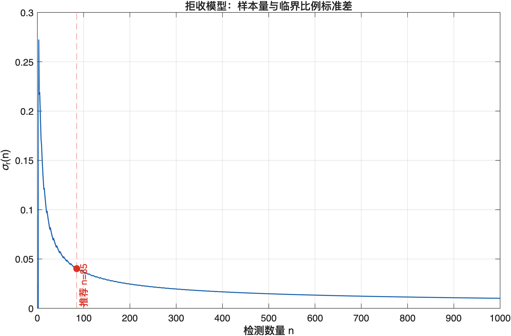
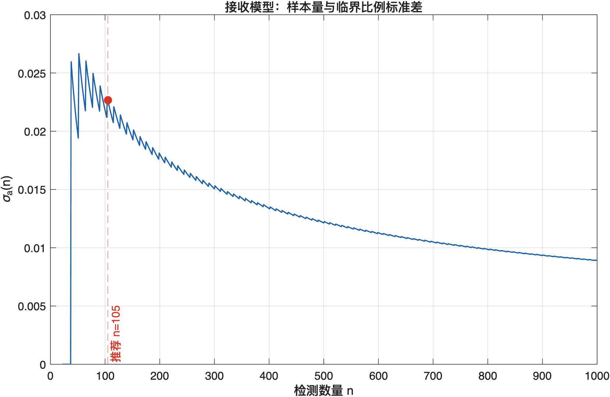

# 问题一：基于精确二项分布的单边抽样检测模型报告

## 1. 一句话理解整个思路

从一批零配件中随机抽取 \(n\) 件并记录次品数 \(X\)：如果次品数多到在“真实次品率只有 10%”的情况下很难出现，就拒收；如果次品数少到在“真实次品率至少为 10%”的情况下很难出现，就接收。拒收和接收回答的是两个不同方向的问题，因此分别建立两个单边模型。

完整计算顺序为：

```text
设定标称次品率 p0=0.1
        ↓
枚举检测数量 n=1,2,...,N
        ↓
分别计算拒收临界值 xr(n) 和接收临界值 xa(n)
        ↓
逐一检查尾概率是否满足 0.05 和 0.10 的约束
        ↓
计算临界样本比例、方差和标准差
        ↓
利用 n-标准差曲线判断继续增加检测数量的收益
        ↓
分别得到拒收方案和接收方案
```

这里需要始终区分两类参数：

- \(0.05\) 和 \(0.10\) 是概率约束，用来控制错误判断风险；
- \(\epsilon=0.01\) 是稳定性阈值，用来辅助选择检测数量，不代表置信水平。

## 2. 问题目标

供应商声称零配件的真实次品率不超过 10%。企业无法检测整批零配件，只能随机抽取一部分进行检测。问题要求分别给出以下两套方案：

1. 当样本结果较差时，以 95% 的信度认定真实次品率超过 10%，从而拒收该批零配件；
2. 当样本结果较好时，以 90% 的信度认定真实次品率不超过 10%，从而接收该批零配件。

这两项要求不是同一次假设检验的两个结论。第一项关心“有没有充分证据说明次品率偏高”，第二项关心“有没有充分证据说明次品率偏低或不超过标称值”。本报告按题意将其独立计算。

## 3. 符号与变量说明

### 3.1 数学符号

| 符号 | 含义 | 类型或单位 | 本实验取值 |
|---|---|---|---:|
| \(p\) | 该批零配件真实但未知的次品率 | 概率，无量纲 | 未知 |
| \(p_0\) | 供应商给出的标称次品率，也是检验边界 | 概率，无量纲 | \(0.1\) |
| \(n\) | 从该批零配件中随机抽取并检测的数量 | 件 | \(1,2,\ldots,N\) |
| \(N\) | 枚举时允许考察的最大检测数量 | 件 | \(1000\) |
| \(X\) | \(n\) 件样本中出现的次品数量，是随机变量 | 件 | \(0,1,\ldots,n\) |
| \(x\) | 检测完成后实际观察到的次品数量，是 \(X\) 的一个具体取值 | 件 | 由检测结果决定 |
| \(k\) | 二项概率求和时使用的次品数下标 | 件 | \(0,1,\ldots,n\) |
| \(B(n,p)\) | 参数为 \(n,p\) 的二项分布 | 概率分布 | — |
| \(\binom{n}{k}\) | 从 \(n\) 个位置中选出 \(k\) 个次品位置的组合数 | 无量纲 | \(\frac{n!}{k!(n-k)!}\) |
| \(x_r(n)\) | 样本量为 \(n\) 时的拒收临界次品数 | 件 | 由上尾概率确定 |
| \(x_a(n)\) | 样本量为 \(n\) 时的接收临界次品数 | 件 | 由下尾概率确定 |
| \(\alpha_r\) | 拒收模型允许的最大错误拒收概率 | 概率，无量纲 | \(0.05\) |
| \(\alpha_a\) | 接收模型允许的最大边界错误接收概率 | 概率，无量纲 | \(0.10\) |
| \(\hat p_r\) | 拒收临界值对应的样本次品率，即 \(x_r/n\) | 比例，无量纲 | 随 \(n\) 变化 |
| \(\hat p_a\) | 接收临界值对应的样本次品率，即 \(x_a/n\) | 比例，无量纲 | 随 \(n\) 变化 |
| \(V_r(n)\) | 拒收临界比例的方差辅助指标 | 无量纲 | \(\hat p_r(1-\hat p_r)/n\) |
| \(V_a(n)\) | 接收临界比例的方差辅助指标 | 无量纲 | \(\hat p_a(1-\hat p_a)/n\) |
| \(\sigma_r(n)\) | 拒收临界比例的标准差辅助指标 | 无量纲 | \(\sqrt{V_r(n)}\) |
| \(\sigma_a(n)\) | 接收临界比例的标准差辅助指标 | 无量纲 | \(\sqrt{V_a(n)}\) |
| \(g(n)\) | 检测量从 \(n-1\) 增至 \(n\) 时标准差的相对下降率 | 比例，无量纲 | 随 \(n\) 变化 |
| \(\epsilon\) | 判断标准差相对下降是否已经较小的阈值 | 比例，无量纲 | \(0.01\) |
| \(W\) | 稳定条件需要连续满足的次数 | 个相邻点 | \(10\) |
| \(n_r\) | 最终推荐的拒收模型检测数量 | 件 | \(85\) |
| \(n_a\) | 最终推荐的接收模型检测数量 | 件 | \(105\) |

### 3.2 容易混淆的符号

随机变量 \(X\) 表示“检测前还不知道会出现多少件次品”，小写 \(x\) 表示检测后得到的实际数量。例如抽检 85 件后发现 14 件次品，此时 \(n=85\)、\(x=14\)。

\(x_r\) 和 \(x_a\) 都是程序事先算出的临界值，不是实际检测结果。实际检测得到 \(x\) 后，再比较 \(x\) 与临界值：

```text
若 x ≥ xr，则触发拒收判定；
若 x ≤ xa，则触发接收判定。
```

本报告将接收模型的概率上限记为 \(\alpha_a\)，而不记为通常意义上的第二类错误概率 \(\beta\)。原因是接收模型重新设置了原假设和备择假设，代码实际控制的是该模型在边界 \(p=p_0\) 处的下尾概率。

## 4. 基本概率模型

假设每件零配件只有“合格”和“次品”两种状态，每件成为次品的概率均为 \(p\)，各件检测结果相互独立，则 \(n\) 件样本中的次品数满足

$$
X\sim B(n,p).
$$

当样本中恰好出现 \(k\) 件次品时，其概率为

$$
P(X=k)=\binom{n}{k}p^k(1-p)^{n-k}.
$$

这一公式的含义是：

- \(\binom{n}{k}\) 表示 \(k\) 件次品可能出现在样本中的不同位置组合；
- \(p^k\) 表示这 \(k\) 件均为次品的概率乘积；
- \((1-p)^{n-k}\) 表示其余 \(n-k\) 件均合格的概率乘积。

本题的检验边界为 \(p=p_0=0.1\)。拒收事件 \(X\ge x_r\) 的概率随 \(p\) 增大而增大，因此在原假设 \(p\le p_0\) 内，最大错误拒收概率出现在边界 \(p=p_0\)。接收事件 \(X\le x_a\) 的概率随 \(p\) 增大而减小，因此在原假设 \(p\ge p_0\) 内，最大边界错误接收概率同样出现在 \(p=p_0\)。所以两套约束都可以在 \(p_0=0.1\) 处计算。

## 5. 95% 信度拒收模型

### 5.1 这个模型要回答什么

拒收模型要判断样本是否差到足以支持“真实次品率超过 10%”。其假设为

$$
H_0:p\le0.1,\qquad H_1:p>0.1.
$$

若样本中次品较多，则结果更支持 \(H_1\)。因此拒收区域位于二项分布的右侧，即

$$
X\ge x_r.
$$

### 5.2 为什么计算上尾概率

假定真实次品率恰好为 \(p_0=0.1\)，观察到至少 \(x_r\) 件次品的概率为

$$
P_{p_0}(X\ge x_r)
=\sum_{k=x_r}^{n}\binom{n}{k}p_0^k(1-p_0)^{n-k}.
$$

如果这一概率不超过 0.05，表示在“真实次品率没有超过 10%”的边界情况下，这么差或更差的样本结果出现概率最多为 5%。因此规定

$$
\boxed{
P_{p_0}(X\ge x_r)\le\alpha_r=0.05
}.
$$

### 5.3 临界值怎样选

对固定的 \(n\)，可能有多个 \(x_r\) 满足概率约束。\(x_r\) 越大，拒收条件越苛刻。为了在控制错误拒收率的前提下保留尽可能宽的拒收区域，取满足约束的最小整数：

$$
x_r(n)=\min\left\{x:\ P_{p_0}(X\ge x)\le0.05\right\}.
$$

以最终推荐的 \(n=85\) 为例，MATLAB 计算得到

$$
P_{0.1}(X\ge14)=0.042310\le0.05,
$$

但将临界值放宽为 13 时

$$
P_{0.1}(X\ge13)=0.079807>0.05.
$$

所以 \(x_r=14\) 是 \(n=85\) 下最宽的可行拒收临界值。

## 6. 90% 信度接收模型

### 6.1 这个模型要回答什么

接收模型要判断样本是否好到足以支持“真实次品率低于标称边界”。其单边假设写为

$$
H_0:p\ge0.1,\qquad H_1:p<0.1.
$$

若样本中次品很少，则结果更支持 \(H_1\)。因此接收区域位于二项分布的左侧，即

$$
X\le x_a.
$$

在文字结论中，可依题意将通过该检验的批次表述为“在 90% 信度要求下接受该批零配件”。严格地说，该检验提供的是支持 \(p<0.1\) 的单边证据，而不是证明 \(p\) 必然不超过 0.1。

### 6.2 为什么计算下尾概率

假定真实次品率为 \(p_0=0.1\)，观察到不多于 \(x_a\) 件次品的概率为

$$
P_{p_0}(X\le x_a)
=\sum_{k=0}^{x_a}\binom{n}{k}p_0^k(1-p_0)^{n-k}.
$$

为满足 90% 的单边信度要求，规定该概率不超过 0.10：

$$
\boxed{
P_{p_0}(X\le x_a)\le\alpha_a=0.10
}.
$$

### 6.3 临界值怎样选

对固定的 \(n\)，\(x_a\) 越大，接收区域越宽。为了在满足概率约束的前提下尽可能多地接收样本结果，取满足约束的最大整数：

$$
x_a(n)=\max\left\{x:\ P_{p_0}(X\le x)\le0.10\right\}.
$$

以最终推荐的 \(n=105\) 为例，MATLAB 计算得到

$$
P_{0.1}(X\le6)=0.089860\le0.10,
$$

但将临界值放宽为 7 时

$$
P_{0.1}(X\le7)=0.164497>0.10.
$$

所以 \(x_a=6\) 是 \(n=105\) 下最宽的可行接收临界值。

## 7. 为什么满足概率约束后还要选择 \(n\)

概率约束只能告诉企业：对于某个给定的检测数量 \(n\)，应该把临界次品数设为多少。它不会自动给出唯一的检测数量。

例如拒收模型在 \(n=2\) 时已经存在形式上的可行规则：只有两件全是次品才拒收，此时

$$
P_{0.1}(X\ge2)=0.01\le0.05.
$$

这一规则虽然满足错误拒收概率约束，却几乎无法识别一般的偏高次品率。接收模型直到 \(n=22\) 才首次存在临界值，此时只能在零件次品数为 0 时接收。可见“首个可行 \(n\)”通常不适合作为最终检测数量。

为了在检测成本和抽样波动之间作折中，本实验继续计算临界样本比例的方差和标准差：

$$
\hat p_r=\frac{x_r}{n},\qquad
V_r(n)=\frac{\hat p_r(1-\hat p_r)}{n},\qquad
\sigma_r(n)=\sqrt{V_r(n)},
$$

$$
\hat p_a=\frac{x_a}{n},\qquad
V_a(n)=\frac{\hat p_a(1-\hat p_a)}{n},\qquad
\sigma_a(n)=\sqrt{V_a(n)}.
$$

\(n\) 增大时，标准差总体下降，表示临界样本比例的波动尺度减小；但检测数量也随之增加。标准差曲线开始变平后，继续增加样本带来的相对收益较小，可以把曲线进入稳定区域的位置作为候选检测数量。

需要说明的是，这里的 \(\sigma_r,\sigma_a\) 使用临界比例 \(x/n\) 计算，是本方案规定的选样辅助指标。它们不等于在标称次品率处计算的固定标准误

$$
\sqrt{\frac{p_0(1-p_0)}{n}}.
$$

## 8. \(\epsilon=0.01\) 到底表示什么

### 8.1 定义

标准差从 \(n-1\) 到 \(n\) 的相对下降率定义为

$$
g(n)=\frac{\sigma(n-1)-\sigma(n)}{\sigma(n-1)}.
$$

设置

$$
\epsilon=0.01
$$

表示：如果增加 1 件检测量后，标准差的下降幅度不足原标准差的 1%，就认为这一步的精度收益已经较小，即

$$
0\le g(n)<0.01.
$$

例如

$$
\sigma(n-1)=0.0400,\qquad \sigma(n)=0.0397,
$$

则

$$
g(n)=\frac{0.0400-0.0397}{0.0400}=0.0075=0.75\%<1\%.
$$

所以这一步满足稳定条件。

### 8.2 为什么不能只检查一个点

\(x_r\) 和 \(x_a\) 必须取整数。当临界值保持不变时，标准差逐渐下降；当临界值增加 1 时，临界比例会突然变化，标准差可能向上跳。因此原始曲线呈锯齿状，某一个点满足 \(g(n)<1\%\) 不足以证明曲线已经稳定。

程序先对有效标准差使用 5 点移动中位数减弱整数跳变，再要求连续 \(W=10\) 个相邻点满足稳定条件。这里：

- \(\epsilon=0.01\) 控制“每一步允许多小的相对收益”；
- \(W=10\) 控制“这种低收益状态需要持续多久”；
- \(\epsilon\) 越小或 \(W\) 越大，判定通常越严格。

接收模型还有一个特殊边界：当 \(22\le n\le37\) 时，计算得到 \(x_a=0\)，因而指定公式给出 \(\sigma_a=0\)。零标准差来自临界比例恰好为 0，并不表示只检测 22 件就具有无限精度。因此程序只使用有限且严格为正的标准差判断稳定区间。

## 9. 求解算法

输入参数为

$$
p_0=0.1,\quad \alpha_r=0.05,\quad
\alpha_a=0.10,\quad N=1000,\quad
\epsilon=0.01,\quad W=10.
$$

计算步骤如下：

1. 枚举 \(n=1,2,\ldots,N\)；
2. 对每个 \(n\)，从小到大搜索 \(x_r\)，找到首个满足上尾概率不超过 0.05 的整数；
3. 对每个 \(n\)，从大到小搜索 \(x_a\)，找到首个满足下尾概率不超过 0.10 的整数；
4. 若不存在可观测临界值，则将该位置记为 `NaN`，不使用 \(n+1\) 或 \(-1\) 代替；
5. 计算两套临界比例、方差、标准差及其相对下降率；
6. 绘制 \(n-\sigma_r\) 和 \(n-\sigma_a\) 曲线；
7. 对有效标准差进行 5 点移动中位数平滑；
8. 找到连续 10 个相邻点满足相对下降率小于 1% 的首个稳定区间；
9. 分别输出拒收和接收方案。

二项尾概率由 MATLAB 基础函数 `betainc` 计算，避免直接计算大组合数产生数值溢出，也不依赖 Statistics and Machine Learning Toolbox。

## 10. MATLAB 实验结果

MATLAB R2025b 对 \(n=1,\ldots,1000\) 完整枚举后得到表 1。

**表 1  默认稳定性参数下的推荐方案**

| 模型 | 检测数量 | 临界次品数 | 临界样本比例 | 方差 | 标准差 | 边界概率 |
|---|---:|---:|---:|---:|---:|---:|
| 95% 信度拒收 | \(n_r=85\) | \(x_r=14\) | 0.164706 | 0.0016186 | 0.040231 | 0.042310 |
| 90% 信度接收 | \(n_a=105\) | \(x_a=6\) | 0.057143 | 0.0005131 | 0.022652 | 0.089860 |

由此得到具体检测规则：

$$
\boxed{\text{抽检 85 件，若 }X\ge14\text{，则拒收该批零配件。}}
$$

$$
\boxed{\text{抽检 105 件，若 }X\le6\text{，则接收该批零配件。}}
$$

两套方案独立使用，不能把 \(n=85\) 的拒收阈值和 \(n=105\) 的接收阈值直接拼成同一批样本的三段判定规则。

## 11. 标准差曲线解释

### 11.1 拒收曲线



拒收曲线总体随 \(n\) 下降。曲线上的小幅锯齿来自 \(x_r\) 的整数变化，并非程序计算误差。默认规则将 \(n=85\) 标为稳定区间起点，此时 \(\sigma_r=0.040231\)。继续增加检测数量仍会降低标准差，但单位样本带来的相对改善已经进入约 1% 的量级。

### 11.2 接收曲线



接收曲线的锯齿比拒收曲线明显，因为较小的 \(x_a\) 每增加 1 都会明显改变 \(x_a/n\)。图中 \(n=22\) 至 \(37\) 的零值来自 \(x_a=0\)，该区间未参与稳定性推荐。默认规则得到 \(n=105\)，此时 \(x_a=6\)、\(\sigma_a=0.022652\)。

## 12. 稳定性参数敏感性

\(\epsilon\) 和 \(W\) 不是题目给定参数，因此需要检查它们是否改变最终方案。部分结果见表 2。

**表 2  稳定性规则改变时的推荐结果**

| \(\epsilon\) | 连续窗口 \(W\) | 拒收方案 \((n_r,x_r)\) | 接收方案 \((n_a,x_a)\) |
|---:|---:|---:|---:|
| 0.005 | 5 | \((167,24)\) | \((193,13)\) |
| 0.005 | 10 | \((184,26)\) | \((200,14)\) |
| 0.010 | 5 | \((62,11)\) | \((98,5)\) |
| 0.010 | 10 | \((85,14)\) | \((105,6)\) |
| 0.020 | 5 | \((41,8)\) | \((53,2)\) |
| 0.020 | 10 | \((41,8)\) | \((53,2)\) |

当 \(\epsilon\) 从 0.02 减小至 0.005 时，推荐检测数量明显增加，因为更小的 \(\epsilon\) 要求标准差曲线下降得更慢才算稳定。窗口从 5 增至 10 也可能推迟稳定区间。由此可见，概率临界值由精确二项约束确定，而最终检测数量仍依赖企业对检测成本和精度收益的取舍。

若使用 \(W=20\)，接收曲线在 \(N=1000\) 内没有找到满足条件的完整稳定窗口。程序此时返回搜索上限 \(n=1000\) 作为边界标记，不能把它解释成经过验证的推荐值。

## 13. 不同真实次品率下的判定能力

为了避免把“95% 信度”误解成“任何超标批次都有 95% 的概率被拒收”，表 3 计算了默认方案在不同真实次品率下的判定概率。

**表 3  默认方案的判定概率**

| 真实次品率 \(p\) | 拒收方案触发概率 \(P_p(X\ge14)\) | 接收方案触发概率 \(P_p(X\le6)\) |
|---:|---:|---:|
| 0.05 | 0.000080 | 0.727800 |
| 0.08 | 0.007400 | 0.256010 |
| 0.10 | 0.042310 | 0.089860 |
| 0.12 | 0.136470 | 0.025400 |
| 0.15 | 0.396920 | 0.002755 |
| 0.20 | 0.828180 | 0.000034 |

当 \(p=0.10\) 时，拒收概率为 4.231%，没有超过 5%；接收概率为 8.986%，没有超过 10%，两项概率约束均得到满足。当真实次品率增至 20% 时，拒收概率提高到 82.818%。但当真实次品率仅为 15% 时，拒收概率为 39.692%，所以 95% 信度不能解释为对所有 \(p>0.1\) 情况都具有 95% 的检出概率。

## 14. MATLAB 变量与数学符号对应关系

| MATLAB 变量 | 对应数学符号 | 含义 |
|---|---|---|
| `cfg.p0` | \(p_0\) | 标称次品率 |
| `cfg.alphaReject` | \(\alpha_r\) | 拒收上尾概率上限 |
| `cfg.alphaAccept` | \(\alpha_a\) | 接收下尾概率上限 |
| `cfg.nMax` | \(N\) | 最大枚举检测数量 |
| `cfg.epsilon` | \(\epsilon\) | 标准差相对改善阈值 |
| `cfg.stabilityWindow` | \(W\) | 连续稳定窗口长度 |
| `n` | \(n\) | 检测数量序列 |
| `xr` | \(x_r(n)\) | 拒收临界次品数 |
| `xa` | \(x_a(n)\) | 接收临界次品数 |
| `phatReject` | \(\hat p_r\) | 拒收临界样本比例 |
| `phatAccept` | \(\hat p_a\) | 接收临界样本比例 |
| `varianceReject` | \(V_r(n)\) | 拒收临界比例方差 |
| `varianceAccept` | \(V_a(n)\) | 接收临界比例方差 |
| `sigmaReject` | \(\sigma_r(n)\) | 拒收临界比例标准差 |
| `sigmaAccept` | \(\sigma_a(n)\) | 接收临界比例标准差 |
| `probReject` | \(P_{p_0}(X\ge x_r)\) | 拒收上尾概率 |
| `probAccept` | \(P_{p_0}(X\le x_a)\) | 接收下尾概率 |
| `gainReject` | \(g_r(n)\) | 拒收标准差原始相对下降率 |
| `gainAccept` | \(g_a(n)\) | 接收标准差原始相对下降率 |
| `recommendReject` | \(n_r\) | 推荐拒收检测数量 |
| `recommendAccept` | \(n_a\) | 推荐接收检测数量 |

## 15. 结果应当怎样表述

可以将问题一的结论概括为：

> 本文将零配件抽检结果建模为二项随机变量，并针对拒收与接收要求分别建立右尾和左尾精确单边检验。对 \(n=1,\ldots,1000\) 逐一枚举临界值，在满足 \(P_{0.1}(X\ge x_r)\le0.05\) 和 \(P_{0.1}(X\le x_a)\le0.10\) 的基础上，以临界样本比例标准差的边际改善率辅助选择检测数量。当稳定阈值取 \(\epsilon=0.01\)、连续窗口取 \(W=10\) 时，拒收方案为抽检 85 件且次品数不少于 14 件时拒收，对应边界错误拒收概率为 0.042310；接收方案为抽检 105 件且次品数不多于 6 件时接收，对应边界错误接收概率为 0.089860。

## 16. 模型边界

本报告采用的基础模型有以下明确边界：

1. 假设同一批次中每件零配件具有相同次品概率，且抽样结果相互独立；若抽样比例占整批数量较大，应考虑不放回抽样对应的超几何分布；
2. \(85/14\) 和 \(105/6\) 依赖 \(\epsilon=0.01\)、\(W=10\) 以及 5 点平滑规则，不是概率约束唯一导出的检测数量；
3. 临界比例标准差是选样辅助指标，不能替代检验功效或企业实际检测成本；
4. 两套模型分别求解，只适用于题目要求的两个独立情形；若需要同一批样本同时给出“接收、继续检测、拒收”三种决策，应另行建立联合判定或序贯抽样规则。

## 17. 文件与复现方法

MATLAB 主程序：`problem1_binomial_experiment.m`。

回归测试：`test_problem1_binomial_experiment.m`。

在 MATLAB 中切换到本题目录后执行：

```matlab
results = problem1_binomial_experiment();
test_problem1_binomial_experiment;
```

主要结果文件位于 `results_problem1` 目录：

- `reject_thresholds.csv`：所有 \(n\) 对应的拒收临界值、方差、标准差和上尾概率；
- `accept_thresholds.csv`：所有 \(n\) 对应的接收临界值、方差、标准差和下尾概率；
- `reject_sigma_curve.png`、`accept_sigma_curve.png`：两条标准差曲线；
- `sensitivity_analysis.csv`：稳定性参数敏感性结果；
- `operating_characteristics.csv`：不同真实次品率下的判定概率；
- `workspace_results.mat`：完整 MATLAB 工作区结果。
