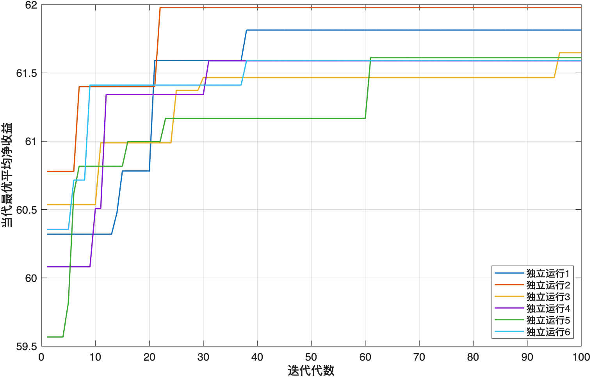

# 七、问题三的建模与解决

## 7.1 问题分析与模型扩展

### 7.1.1 两层装配结构

问题三将问题二的单层装配扩展为两道工序：零配件1—3组成半成品1，零配件4—6组成半成品2，零配件7—8组成半成品3，三个半成品再装配为成品。相应装配拓扑为

$$
\mathcal G_1=\{1,2,3\},\qquad
\mathcal G_2=\{4,5,6\},\qquad
\mathcal G_3=\{7,8\},
$$

$$
\mathcal G_j\longrightarrow \text{半成品 }j,
\qquad
\{\text{半成品1,2,3}\}\longrightarrow\text{成品}.
$$

多一层装配后，缺陷可能由零配件、半成品装配或成品装配产生；不合格品的回收也形成两条路径：不合格半成品可拆为零配件，不合格成品可先拆为半成品，其中的不合格半成品还可继续拆为零配件。因此，企业不仅需要选择检测位置，还需决定质量信息如何随回收对象进入下一轮生产。

### 7.1.2 与问题二的继承关系

本文沿用问题二的收益口径，将“开始组织生产至最终完成一件合格交付”作为一个更新周期。同一订单只计算一次销售收入，周期内发生的重复采购、两层装配、检测、市场调换和拆解费用均计入成本。零配件、半成品与成品的质量状态具有随机性，故仍以策略的期望周期净收益为优化目标。

问题三新增半成品库存、半成品内部零配件质量以及两级拆解状态。若采用解析期望，需要枚举不同层次的已知与未知质量组合；若采用动态规划，状态数会随库存质量和循环轮次迅速增长。为保留完整生产机理并与问题二保持统一，本文将原随机生产闭环扩展为分层随机生产闭环，通过蒙特卡洛模拟评价策略，再用遗传算法搜索高收益方案。

### 7.1.3 模型边界

本文认为各零配件质量和各层装配失效事件相互独立，检测完全准确，拆解不改变组成对象的质量。正品零配件投入后，半成品仍按题给次品率发生装配失效；正品半成品投入后，成品亦按题给次品率发生装配失效。未经成品检测而进入市场的不合格品视为被用户发现并退回。不考虑产能、交货期和库存持有成本，回收件的价值体现为节约后续采购或装配费用。

## 7.2 决策变量与策略编码

### 7.2.1 染色体构造

完整策略编码为

$$
X(8)\mid H(3)\mid Y\mid D(3)\mid Z
\mid R(8)\mid U(8)\mid S(3)\mid V(3)
$$

其中，$X,H,Y$ 分别表示新购零配件、半成品和成品检测；$D,Z$ 表示半成品和成品拆解；$R,U$ 表示回收零配件检测和利用；$S,V$ 表示回收半成品检测和利用。染色体共含

$$
8+3+1+3+1+8+8+3+3=38
$$

个二进制位，未经修复的策略空间为

$$
2^{38}=274877906944.
$$

该规模无法沿用问题二的全枚举复核，需要采用启发式搜索。

### 7.2.2 无效编码修复

根据生产逻辑对染色体执行以下修复：若半成品 $j$ 不拆解，则对应组内回收零配件的检测和利用位均归零；若某回收对象不利用，则其检测位归零；若成品不拆解，则回收半成品的检测和利用位均归零。

检测准确且拆解无损时，还存在两条支配规则。若 $x_i=1$，零配件 $i$ 在进入装配前已经检测合格，拆解后的重复检测只增加成本，故令 $r_i=0$；若 $h_j=1$，半成品 $j$ 已经检测合格，成品拆解后无需再次检测，故令 $s_j=0$。上述修复删除了行为相同或严格劣势的编码，不改变可实现的高收益策略。

## 7.3 分层随机生产闭环模型

### 7.3.1 回收库存状态

设 $A_{i,t}^{(p)}=1$ 表示第 $t$ 轮开始时存在回收零配件 $i$，$Q_{i,t}^{(p)}$ 为其真实质量；$A_{j,t}^{(s)}=1$ 表示存在回收半成品 $j$，$Q_{j,t}^{(s)}$ 为其真实质量。由于回收半成品后续可能继续拆解，模型同时保留其内部各零配件的真实质量。初始没有回收库存：

$$
A_{i,1}^{(p)}=0,\qquad A_{j,1}^{(s)}=0.
$$

每轮生产优先使用回收对象；没有相应库存时，再采购零配件或重新装配半成品。

### 7.3.2 零配件获取

当存在回收零配件时，企业不再支付购买费用，投入质量由库存状态决定。若没有回收件且 $x_i=0$，只购买一个新件并直接装配：

$$
G_{i,t}\sim\operatorname{Bernoulli}(1-p_i),
\qquad C_{i,t}^{(p)}=c_i.
$$

若 $x_i=1$，每次采购后均进行检测，发现不合格则重新购买，直至得到合格件。设采购次数为 $K_{i,t}$，则

$$
K_{i,t}\sim\operatorname{Geometric}(1-p_i),
$$

$$
C_{i,t}^{(p)}=K_{i,t}(c_i+d_i),
\qquad G_{i,t}=1,
$$

其中，$c_i$ 和 $d_i$ 分别为购买单价和检测成本。

### 7.3.3 半成品质量与处置

令 $B_{j,t}^{(s)}$ 表示半成品 $j$ 的装配过程是否成功，则

$$
B_{j,t}^{(s)}\sim\operatorname{Bernoulli}(1-p_j^{(s)}).
$$

半成品真实质量为

$$
G_{j,t}^{(s)}=
\left(\prod_{i\in\mathcal G_j}G_{i,t}\right)B_{j,t}^{(s)}
$$

每次半成品装配支付8元。若 $h_j=0$，半成品不经检测进入下一工序；若 $h_j=1$，支付4元检测费，只有合格半成品进入成品装配。被发现的不合格半成品在 $\delta_j=0$ 时废弃，在 $\delta_j=1$ 时支付6元拆解费，并将组内零配件按 $(r_i,u_i)$ 处理，然后重新组织该半成品生产。

### 7.3.4 成品质量与市场反馈

令 $B_t^{(f)}$ 表示成品装配过程是否成功，则

$$
B_t^{(f)}\sim\operatorname{Bernoulli}(1-p_f).
$$

第 $t$ 轮成品质量为

$$
G_t^{(f)}=
\left(\prod_{j=1}^{3}G_{j,t}^{(s)}\right)B_t^{(f)}
$$

每次成品装配支付8元。若 $y=1$，每轮另支付6元成品检测费，不合格品在企业内部被发现；若 $y=0$，成品直接进入市场，不合格时支付40元调换损失并继续生产替换品。因此，第 $t$ 轮的成品检测费和调换损失分别为

$$
C_t^{(f,\mathrm{inspect})}=6y,
$$

$$
C_t^{(\mathrm{return})}=40(1-y)(1-G_t^{(f)}).
$$

### 7.3.5 两级拆解回收

当成品不合格且 $z=0$ 时，成品直接废弃；当 $z=1$ 时，企业支付10元，将成品拆为三个保持原质量的半成品。对半成品 $j$，若 $v_j=0$ 则废弃；若 $v_j=1,s_j=0$ 则连同其内部零配件质量直接存入库存；若 $v_j=1,s_j=1$，支付4元进行检测，合格半成品进入库存，不合格半成品在 $\delta_j=1$ 时继续拆为零配件。

拆出的零配件 $i$ 在 $u_i=0$ 时废弃，在 $u_i=1,r_i=0$ 时直接进入库存，在 $u_i=1,r_i=1$ 时支付 $d_i$ 检测，仅保留合格件。由此，成品拆解形成

$$
\text{不合格成品}
\longrightarrow\text{回收半成品}
\longrightarrow\text{回收零配件}
$$

的两级反馈路径，下一轮生产的对象来源和质量取决于上一轮状态。

### 7.3.6 周期收益函数

将完整生产周期的成本分为采购、检测、装配、市场调换和拆解五类：

$$
C(S)=C_{\mathrm{purchase}}+C_{\mathrm{inspection}}
+C_{\mathrm{assembly}}+C_{\mathrm{return}}
+C_{\mathrm{disassembly}}.
$$

一件产品的售价为200元，故策略 $S$ 的周期净收益为

$$
R(S)=200-C(S).
$$

模型目标为

$$
S^*=\arg\max_{S\in\Omega}E[R(S)].
$$

## 7.4 蒙特卡洛评价与遗传算法求解

### 7.4.1 适应度评价

对给定策略独立模拟 $N$ 个生产周期，以样本平均净收益作为适应度：

$$
\widehat F_N(S)=\frac{1}{N}\sum_{k=1}^{N}R_k(S).
$$

均值的标准误差和95%蒙特卡洛区间为

$$
SE=\frac{s_R}{\sqrt N},
\qquad
CI_{95\%}=\widehat F_N(S)\pm1.96SE.
$$

其中，$s_R$ 为收益样本标准差。单个周期最多允许80轮成品装配，每个半成品最多尝试80次；超过上限仍未完成交付时施加20000元数值惩罚。最终入选策略的闭环完成率为1，故该保护条件没有改变最终结果。

### 7.4.2 遗传算法设置

遗传算法采用种群80、迭代100代、均匀交叉概率0.8、单个位变异概率0.03、锦标赛规模3和精英保留数2。搜索阶段每个策略进行1200次仿真，每次GA保留收益最高的10个候选，共独立运行6次。

每代先修复无效编码，再计算不同策略的蒙特卡洛适应度；通过锦标赛选择父代，经均匀交叉和位翻转变异产生子代，并直接保留当代最优的2个个体。由于收益可能为负，锦标赛选择避免了轮盘赌对负适应度进行人为平移。

### 7.4.3 候选策略复评

38位策略无法完整枚举，本文合并6次GA保留的候选策略和4类规则基准，去重后对每个候选执行300000次独立仿真，以大样本复评均值确定最终方案。因此，所得结果是重复启发式搜索和独立复评下发现的稳定最优策略，不作严格全局最优声明。

## 7.5 结果与决策分析

### 7.5.1 最优策略及指标

最终得到的最优染色体为

$$
11111111\mid111\mid0\mid111\mid1
\mid00000000\mid11111111\mid000\mid111
$$

该编码表示：检测全部新购零配件和三个半成品，不检测成品；三类不合格半成品和不合格成品均拆解；回收零配件与回收半成品不重复检测，全部直接利用。表7-1仅列出评价方案经济性、可行性和交付效率所需的5项核心指标。

**表7-1 问题三最优策略的核心指标**

| 核心指标 | 结果 |
|---|---|
| 平均净收益 | 60.1574元/次合格交付 |
| 95%蒙特卡洛区间 | [60.0665, 60.2483]元 |
| 闭环完成率 | 1.000000 |
| 平均成品装配次数 | 1.1121次 |
| 平均市场退回次数 | 0.1121次 |

### 7.5.2 分层质量控制机理

8个零配件的次品率均为10%，且检测成本相对于购买价格较低。坏件若未在采购端被发现，会继续消耗半成品装配费，并可能进入成品工序，形成成本放大。因此，最优方案首先检测全部新购零配件。

半成品检测构成两道装配工序之间的质量屏障。支付4元检测费可以阻止不合格半成品与其余两个半成品共同进入成品装配，并允许企业立即拆解回收其中的合格零配件。故三个半成品均选择检测和拆解。

在全部半成品已检测合格的条件下，成品失效只来自10%的成品装配失效。若检测成品，完成一次合格交付的理论检测费用为

$$
\frac{6}{1-0.1}=6.6667\text{元};
$$

若不检测成品，理论调换损失为

$$
40\times\frac{0.1}{1-0.1}=4.4444\text{元}.
$$

后者较低，且不合格成品拆解后能够直接回收三个合格半成品，因此最优策略不检测成品。已检测合格的零配件和半成品在无损拆解后质量不变，重复检测不增加信息，故两类回收对象均直接利用。

### 7.5.3 基准策略比较

为判断各层决策的实际贡献，将最优策略与三类规则策略进行比较，结果见表7-2。

**表7-2 最优策略与规则基准的收益比较**

| 策略 | 平均净收益/元 | 95%蒙特卡洛区间/元 |
|---|---:|:---:|
| 全部不检测、不拆解 | -242.1681 | [-243.6329, -240.7032] |
| 各层检测且拆解回用 | 58.0173 | [57.9558, 58.0788] |
| 分层质控、直接回用 | 60.1574 | [60.0665, 60.2483] |
| 只检测半成品和成品 | 51.1575 | [51.0450, 51.2699] |

全部不检测时，零配件缺陷可能经过两层装配后才在市场端暴露，重复生产与40元调换损失使平均收益降为负值。只检测半成品和成品虽能拦截缺陷，但无法避免坏零配件已经造成的半成品装配浪费，其收益比最优策略低约9元。若在最优策略上增加成品检测，收益由60.1574元降至58.0173元，与前述检测费和调换损失的理论比较一致。

## 7.6 模型检验

### 7.6.1 理论一致性检验

最优策略检测全部新购零配件，故半成品失效仅来自10%的装配失效。三个合格半成品所需的理论总装配次数为

$$
3\times\frac{1}{1-0.1}=3.3333,
$$

仿真结果为3.3342，相对偏差约0.027%。进入成品装配的半成品均已检测合格，理论平均成品装配次数为

$$
\frac{1}{1-0.1}=1.1111,
$$

仿真结果为1.1121，相对偏差约0.086%。理论值与仿真值吻合，验证了两层质量生成、重复装配和闭环终止之间的状态关系。

### 7.6.2 搜索稳定性与收敛

图7-1给出了6次独立GA运行的当代最优适应度。多数运行在前40代完成主要改进，第5次和第3次运行分别在约第61代和第96代继续找到更高适应度个体；精英保留使各曲线均保持不下降。

至第100代时，6条曲线均进入稳定区间。6次搜索中有5次在修复后得到最终编码，命中率为83.33%。另一次得到的边界策略在300000次复评下收益为60.0061元，低于最终策略的60.1574元。多次搜索与统一复评降低了单次GA随机性和1200次适应度样本波动对结果排序的影响。

## 7.7 本问小结

本文在问题二随机生产闭环的基础上，增加半成品质量、回收半成品及其内部零配件状态，建立两道工序下的分层随机生产闭环模型。通过蒙特卡洛评价、6次遗传算法搜索和300000次候选复评，得到策略 `11111111|111|0|111|1|00000000|11111111|000|111`，平均净收益为60.1574元/次合格交付。

该方案在采购端检测全部零配件，在工序间检测全部半成品，但不检测成品；两层不合格品均拆解，回收零配件和半成品利用已有质量信息直接回用。理论次数、规则基准和独立搜索结果均支持上述决策。该分层状态转移结构可继续用于问题四的策略求解。
