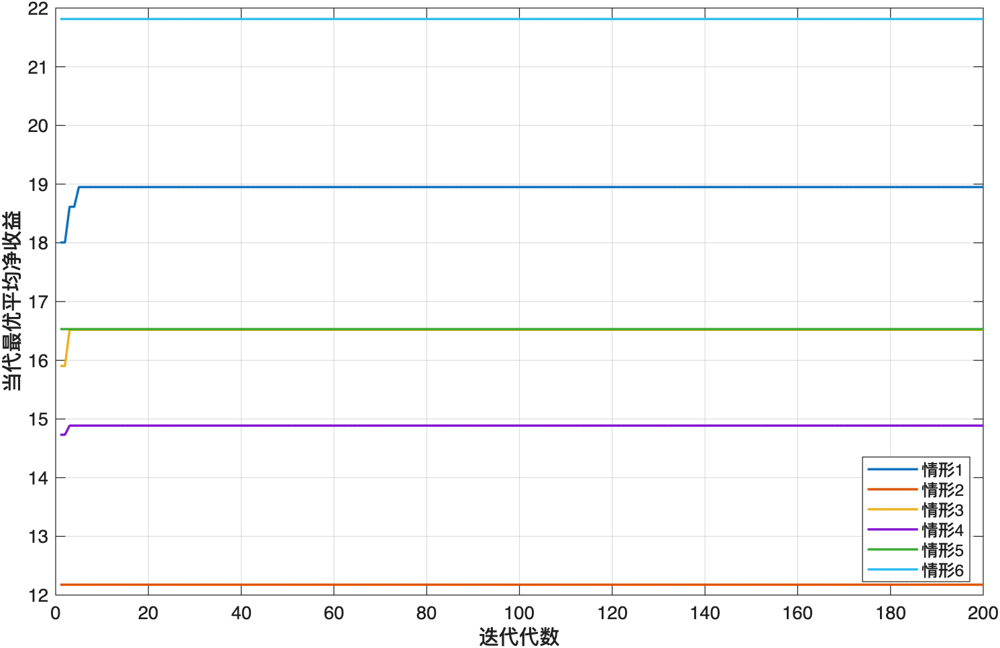

# 六、问题二的建模与解决

## 6.1 问题分析

### 6.1.1 决策之间的耦合关系

问题二要求企业针对六种生产情形，分别决定是否检测两种零配件、是否检测成品、是否拆解不合格品，以及是否检测并重新利用拆解所得零配件。上述决策并非彼此独立。零配件检测会改变进入装配环节的质量分布；成品检测决定不合格品在企业内部还是市场端被发现；拆解与回收又会改变下一轮装配所使用零配件的来源。因此，当前决策产生的结果会反馈到后续生产，构成“采购—检测—装配—交付—拆解—回收—再生产”的闭环过程。

若仅比较一次装配的收入与成本，便会遗漏不合格品引起的替换生产、重复装配以及回收件再利用等后续影响。为使不同策略具有统一的收益口径，本文将从企业开始组织生产，到最终向用户交付一件合格产品的全过程定义为一个生产周期。一个周期中允许发生多轮装配和拆解，但销售收入只计算一次，所有实际发生的采购、检测、装配、调换和拆解费用均计入周期成本。

### 6.1.2 优化目标

设完整决策策略为 $S$，采用该策略完成一个生产周期所得净收益为 $R(S)$。由于零配件质量和装配结果均具有随机性，同一策略在不同生产周期中的收益并不相同。因此，本问不以单次收益为评价依据，而以长期平均净收益作为决策标准，即

$$
S^*=\arg\max_{S\in\Omega}F(S),
\qquad
F(S)=E[R(S)],
$$

其中，$\Omega$ 为全部有效策略构成的可行域。该目标同时考虑了质量风险和由质量问题引起的全部经济后果。

### 6.1.3 模型思路

针对闭环生产过程中存在的状态反馈，本文建立随机生产闭环模型，逐轮模拟零配件获取、装配、成品检测、市场退换以及拆解回收过程；采用蒙特卡洛方法估计每种策略的期望净收益；再以该估计值作为适应度，通过遗传算法搜索较优策略。

问题二仅包含两种零配件。经过无效决策修复后，实际不同的策略只有80种，因此可进一步遍历全部有效策略，并用更大的仿真样本进行统一复评。最终求解路线为

$$
\boxed{
\text{策略编码}
\longrightarrow
\text{随机闭环仿真}
\longrightarrow
\text{蒙特卡洛收益评价}
\longrightarrow
\text{遗传算法搜索}
\longrightarrow
\text{全枚举复核}
}.
$$

其中，闭环模型负责描述生产机理，蒙特卡洛模拟负责计算策略收益，遗传算法和全枚举分别承担搜索与校验功能。

## 6.2 模型准备

### 6.2.1 模型假设

结合题设，对生产过程作如下处理：

1. 两种零配件的质量状态相互独立，检测结果完全准确；
2. 任一零配件不合格时，装配成品必为不合格品；当两个零配件均合格时，成品仍以题给成品次品率发生装配失效；
3. 拆解过程不改变零配件原有质量，拆解所得零配件没有额外残值，其价值仅体现为后续生产中节约的采购成本；
4. 未经成品检测而流入市场的不合格品会被用户发现，企业承担题给调换损失并继续生产替换品；
5. 不考虑产能、交货时间及库存持有成本，企业能够持续采购所需零配件。

这些假设将随机来源限定为零配件质量和装配失效，使不同决策造成的成本差异能够在同一闭环内比较。

### 6.2.2 主要符号

**表6-1 问题二模型的主要符号**

| 符号 | 含义 | 单位 |
|:---:|---|:---:|
| $p_i$ | 零配件 $i$ 的次品率 | — |
| $p_f$ | 合格零配件投入时的成品次品率 | — |
| $c_i$ | 零配件 $i$ 的购买单价 | 元/件 |
| $d_i$ | 零配件 $i$ 的检测成本 | 元/件 |
| $c_a$ | 单次装配成本 | 元/次 |
| $d_f$ | 成品检测成本 | 元/件 |
| $c_s$ | 不合格品拆解成本 | 元/件 |
| $L$ | 不合格品进入市场造成的调换损失 | 元/件 |
| $P$ | 一件产品的市场售价 | 元/件 |
| $T$ | 完成一件合格交付所需的装配轮数 | 次 |
| $R(S)$ | 策略 $S$ 在一个生产周期内的净收益 | 元 |

### 6.2.3 策略编码与可行域压缩

对零配件 $i=1,2$，定义新购件检测变量 $x_i$、回收件检测变量 $r_i$ 和回收利用变量 $u_i$；定义成品检测变量 $y$ 和不合格品拆解变量 $z$。所有变量均为0-1变量，取1表示执行相应操作，取0表示不执行。完整策略写为

$$
S=(x_1,x_2,y,z,r_1,r_2,u_1,u_2),
$$

其染色体表示为

$$
\boxed{x_1x_2\mid yz\mid r_1r_2\mid u_1u_2}.
$$

例如，编码 `10|01|01|11` 表示：检测新购零配件1，不检测新购零配件2；不检测成品，拆解不合格品；回收件1不检测直接利用，回收件2检测后利用。

原始8位编码共有 $2^8=256$ 种组合，但其中存在无效决策。若 $z=0$，生产过程中不会产生回收件，故应令 $r_i=u_i=0$；若 $u_i=0$，检测后仍废弃该回收件只会增加成本，故令 $r_i=0$。经过修复，不拆解时存在

$$
2^2\times2=8
$$

种有效策略；拆解时，每种回收件具有“废弃、直接利用、检测后利用”三种处理方式，故存在

$$
2^2\times2\times3^2=72
$$

种有效策略。因此，本问的可行策略总数为

$$
\boxed{|\Omega|=8+72=80}.
$$

## 6.3 随机生产闭环模型的建立

### 6.3.1 零配件来源与检测

设第 $t$ 轮装配前，$A_{i,t}=1$ 表示库存中存在可用于零配件 $i$ 的回收件，$Q_{i,t}\in\{0,1\}$ 表示该回收件的真实质量，其中1为合格。初始不存在回收库存，即

$$
A_{1,1}=A_{2,1}=0.
$$

每轮装配优先使用已有回收件；没有回收件时，再按策略采购新件。设投入第 $t$ 轮装配的零配件质量为 $G_{i,t}$。

当 $A_{i,t}=1$ 时，企业不再支付购买费用，并有

$$
G_{i,t}=Q_{i,t}.
$$

当 $A_{i,t}=0$ 且 $x_i=0$ 时，只购买一个新件并直接装配，故

$$
G_{i,t}\sim\operatorname{Bernoulli}(1-p_i),
\qquad
C_{i,t}^{\mathrm{source}}=c_i.
$$

当 $A_{i,t}=0$ 且 $x_i=1$ 时，对每次购入的零配件进行检测，若发现不合格则重新采购，直至获得合格件。设所需采购次数为 $K_{i,t}$，则

$$
K_{i,t}\sim\operatorname{Geometric}(1-p_i),
\qquad
P(K_{i,t}=k)=p_i^{k-1}(1-p_i),
$$

相应来源成本为

$$
C_{i,t}^{\mathrm{source}}=K_{i,t}(c_i+d_i),
$$

且此时 $G_{i,t}=1$。因此，零配件检测的经济作用是用重复采购与检测费用，换取进入装配环节的确定合格状态。

### 6.3.2 成品质量生成

每轮装配支付成本 $c_a$。令 $B_t$ 表示两个投入零配件均合格时，装配过程是否成功，则

$$
B_t\sim\operatorname{Bernoulli}(1-p_f).
$$

根据题设质量关系，第 $t$ 轮成品状态为

$$
\boxed{G_{f,t}=G_{1,t}G_{2,t}B_t}.
$$

该式将零配件缺陷和装配失效统一到同一成品质量变量中：只有两个零配件均合格且装配过程成功时，$G_{f,t}=1$。

### 6.3.3 成品检测与市场反馈

若 $y=1$，每轮支付成品检测费用 $d_f$。合格成品进入市场并结束生产周期，不合格品在企业内部被识别并进入处置环节。若 $y=0$，成品直接进入市场；当 $G_{f,t}=0$ 时，企业支付调换损失 $L$，回收该不合格品并重新组织生产。因此，第 $t$ 轮的成品检测费用与调换损失分别为

$$
C_t^{\mathrm{final}}=yd_f,
$$

$$
C_t^{\mathrm{return}}=(1-y)(1-G_{f,t})L.
$$

成品检测并不改变产品质量，它改变的是缺陷被发现的位置。当 $d_f$ 较低而 $L$ 较高时，将不合格品拦截在企业内部通常更有利。

### 6.3.4 拆解回收与状态转移

当 $G_{f,t}=0$ 且 $z=0$ 时，不合格品直接报废，下一轮不存在回收库存：

$$
A_{1,t+1}=A_{2,t+1}=0.
$$

当 $G_{f,t}=0$ 且 $z=1$ 时，企业支付拆解费用 $c_s$。拆出的零配件保持本轮装配前的质量 $G_{i,t}$，并根据 $(r_i,u_i)$ 进入下一轮：

$$
(A_{i,t+1},Q_{i,t+1})=
\begin{cases}
(0,0),&u_i=0,\\
(1,G_{i,t}),&u_i=1,\ r_i=0,\\
(G_{i,t},G_{i,t}),&u_i=1,\ r_i=1.
\end{cases}
$$

第三种情况下需额外支付检测费用 $d_i$，只有合格回收件能够进入下一轮库存。由此可见，拆解是否有利取决于回收件节约的未来采购费用能否覆盖拆解和回收检测成本；直接利用虽可节约检测费，但也可能把不合格件带入下一轮生产。

### 6.3.5 周期成本与收益

第 $t$ 轮发生的总成本为

$$
\begin{aligned}
C_t={}&\sum_{i=1}^{2}C_{i,t}^{\mathrm{source}}+c_a+yd_f\\
&+(1-y)(1-G_{f,t})L\\
&+z(1-G_{f,t})c_s\\
&+z(1-G_{f,t})\sum_{i=1}^{2}u_ir_id_i.
\end{aligned}
$$

定义首次完成合格交付的轮次为

$$
T=\min\{t:G_{f,t}=1\}.
$$

同一订单的售价只计一次，一个生产周期的净收益为

$$
\boxed{R(S)=P-\sum_{t=1}^{T(S)}C_t(S)}.
$$

这一定义把零配件检测、成品检测、市场退换和拆解回收产生的即时成本与后续影响统一到同一目标函数中。

## 6.4 模型求解

### 6.4.1 蒙特卡洛收益评价

给定策略 $S$ 后，独立模拟 $N$ 个生产周期，得到收益样本 $R_1(S),R_2(S),\ldots,R_N(S)$。采用样本平均值估计期望净收益：

$$
\widehat F_N(S)=\frac{1}{N}\sum_{k=1}^{N}R_k(S).
$$

搜索阶段取 $N=5000$。收益均值的蒙特卡洛标准误差和95%区间分别为

$$
SE(S)=\frac{s_R(S)}{\sqrt N},
$$

$$
CI_{95\%}(S)=\widehat F_N(S)\pm1.96SE(S),
$$

其中，$s_R(S)$ 为收益样本标准差。该区间用于衡量有限仿真次数造成的数值波动，而非估计题给次品率的统计误差。

数值实现中，将单个生产周期的最大装配轮数设为100；超过上限仍未完成交付时施加10000元惩罚，以排除反复使用不合格回收件造成的坏状态循环。最终入选策略的闭环完成率均为1，因此该保护条件未改变最终策略。

### 6.4.2 遗传算法搜索

遗传算法以8位策略编码为个体，以 $\widehat F_N(S)$ 为适应度。参数设置为：种群规模100，最大迭代次数200，交叉概率0.8，单个位变异概率0.03，锦标赛规模3，精英保留数2。求解过程为：

1. 随机生成初始策略种群，并按照6.2.3节规则修复无效决策；
2. 对种群中的不同策略进行闭环仿真，计算平均净收益；
3. 每次随机抽取3个个体，通过锦标赛选择父代；
4. 采用均匀交叉重组不同生产环节的决策位；
5. 对各决策位进行0-1变异，并再次修复无效编码；
6. 保留当代收益最高的2个个体，直至达到200代；
7. 每种情形独立运行10次，记录最优策略的重复命中情况。

适应度可能为负，因此使用锦标赛选择可以避免轮盘赌选择中对负适应度进行平移处理。

### 6.4.3 全策略复核

遗传算法适用于后续多零件、多工序的高维决策，但问题二只有80种有效策略。为区分真实收益差异与蒙特卡洛抽样波动，本文对80种策略逐一进行100000次独立仿真，并以大样本复评均值最高的策略作为各情形的最终方案。该复核同时检验遗传算法是否搜索到高收益区域。

## 6.5 模型结果与决策分析

### 6.5.1 最优策略

各情形的最终策略及闭环运行指标见表6-2。

**表6-2 六种生产情形的最优联合策略**

| 情形 | 最优染色体 | 平均净收益/元 | 95%蒙特卡洛区间/元 | 平均装配次数 | 平均退回次数 | 平均拆解次数 | GA命中率 |
|---:|:---:|---:|:---:|---:|---:|---:|---:|
| 1 | `10\|01\|01\|11` | 18.8506 | [18.7559, 18.9453] | 1.22384 | 0.22384 | 0.22384 | 0.90 |
| 2 | `11\|01\|00\|11` | 11.9228 | [11.8264, 12.0191] | 1.25093 | 0.25093 | 0.25093 | 1.00 |
| 3 | `10\|11\|01\|11` | 16.5226 | [16.4364, 16.6088] | 1.22327 | 0 | 0.22327 | 0.50 |
| 4 | `11\|11\|00\|11` | 14.7561 | [14.6742, 14.8380] | 1.25048 | 0 | 0.25048 | 0.70 |
| 5 | `01\|01\|00\|01` | 16.3959 | [16.2900, 16.5018] | 1.23433 | 0.23433 | 0.23433 | 0.60 |
| 6 | `00\|00\|00\|00` | 21.7821 | [21.6789, 21.8852] | 1.16363 | 0.16363 | 0 | 1.00 |

六种最优策略的闭环完成率均为1。情形3和4选择检测成品，其平均市场退回次数为0；其余情形不检测成品，平均退回次数与平均额外装配次数相等，符合“不合格品进入市场后重新生产替换品”的闭环设定。

### 6.5.2 零配件检测与回收决策

情形1的策略为 `10|01|01|11`。零配件1的购买价为4元，前端检测后发现不合格件所造成的废弃成本较低，因此选择检测；零配件2的购买价为18元，而调换损失仅为6元，对全部新购件进行检测并不经济。产品拆解后，零配件2无需重新支付18元购买费，只需支付3元检测费即可判断是否继续利用，故形成“新购件不检、回收件检测后利用”的差异化决策。

情形2和4均检测两种新购零配件。此时进入装配的零配件必然合格，成品失效只来自装配过程，拆出的零配件也保持合格，因此两个回收件均可不经检测直接利用。该结果表明：回收件是否需要再次检测，不仅取决于检测成本，还取决于其进入成品之前是否已经接受过质量筛选。

情形5的策略为 `01|01|00|01`。零配件1检测费为8元，高于其4元购买价，检测与回收均不具有成本优势；零配件2购买价为18元而检测费仅为1元，适合在采购端检测，并在拆解后直接利用。此时两种零配件采用不同策略，说明统一的“全部检测”或“全部不检测”规则不能替代逐零配件决策。

### 6.5.3 成品检测与拆解决策

情形1和3的零配件参数相近，但调换损失分别为6元和30元。情形1不检测成品，而情形3选择检测成品，并将平均市场退回次数由约0.22次降至0。由此可见，成品检测的作用不是提高产品合格率，而是用确定的检测费用替代不合格品流入市场后的高额损失。

情形6的三类次品率均为5%，而拆解成本达到40元。低质量风险使检测的预期收益较小，高拆解费用又使回收节约无法覆盖处置成本，因此最优策略为 `00|00|00|00`，即不检测、不拆解。该情形给出了闭环回收模型的一个经济边界：回收在物理上可行，并不意味着在成本上必然合理。

### 6.5.4 遗传算法收敛特征

图6-1给出了六种情形下一次代表性运行的当代最优适应度。各曲线在前若干代完成主要提升，随后保持不下降，200代足以覆盖本问的搜索需要。

曲线后期不下降是精英保留直接保留当代最优策略的结果。情形2和6从初始种群开始即处于稳定区间，而情形1、3和4在少数几代内完成策略改进。由于本问的有效策略空间较小，收敛速度本身不能证明所得方案为全局最优，最终结论仍以80种策略的大样本复评为准。

## 6.6 模型检验

### 6.6.1 理论一致性检验

当两种新购零配件均被检测时，进入装配环节的零配件均为合格件，成品每轮成功概率为 $1-p_f$。完成合格交付所需装配次数应服从几何分布，其理论均值为

$$
E[T]=\frac{1}{1-p_f}.
$$

情形2和4均有 $p_f=0.2$，故理论平均装配次数为1.25；仿真结果分别为1.25093和1.25048，相对偏差分别约为0.074%和0.038%。理论值与仿真值吻合，验证了零配件筛选、装配失效和闭环终止之间的状态关系。

### 6.6.2 搜索稳定性检验

10次独立遗传算法对六种情形最终策略的命中次数依次为9、10、5、7、6和10次。情形3和5的命中率分别为0.50和0.60，说明若仅采用5000次仿真计算适应度，收益相近的候选策略之间可能出现排序交换。对全部80种策略增加至100000次仿真后，可明显减小均值估计误差，因此表6-2采用复评结果而非单次GA输出。

### 6.6.3 参数敏感性分析

分别将六种情形中的全部次品率和调换损失上下扰动20%，每次扰动后重新优化80种策略，共形成24个测试场景。其中20个场景保持原最优编码，策略保持率为

$$
\frac{20}{24}=83.33\%.
$$

情形1、2和4在四类扰动下均保持原策略。情形3在次品率下降20%时取消新购件检测，但仍检测成品和回收件；情形5在次品率或调换损失上升20%时转为检测成品；情形6在次品率上升20%时开始检测零配件1，但仍不检测成品且不拆解。

敏感性结果说明，情形1、2和4的决策在给定扰动范围内较为稳定；情形3、5和6位于若干检测决策的切换边界附近。在问题四考虑次品率抽样误差时，应重点对后三种情形采用区间参数重新评价。

## 6.7 本问结论

本文以“完成一件合格产品交付”为统一生产周期，建立了覆盖采购、检测、装配、市场退换、拆解和回收利用的随机生产闭环模型，并通过蒙特卡洛模拟估计策略的长期平均净收益。遗传算法给出候选优良策略，再由80种有效策略的全枚举大样本复评确定最终方案。

六种情形的最优编码依次为 `10|01|01|11`、`11|01|00|11`、`10|11|01|11`、`11|11|00|11`、`01|01|00|01` 和 `00|00|00|00`，对应平均净收益分别为18.8506元、11.9228元、16.5226元、14.7561元、16.3959元和21.7821元。结果表明，调换损失升高会促使企业将质量控制前移至成品检测环节；购买价较高且检测费较低的零配件更适合检测和回收利用；拆解成本过高时，放弃回收反而能够获得更高收益。该闭环状态转移和收益评价框架可在问题三中继续扩展到多零配件和多道工序。
