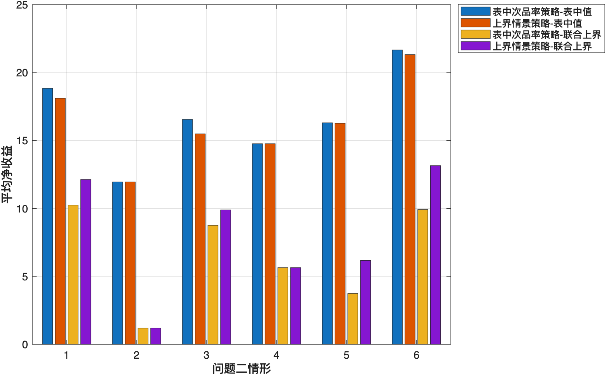
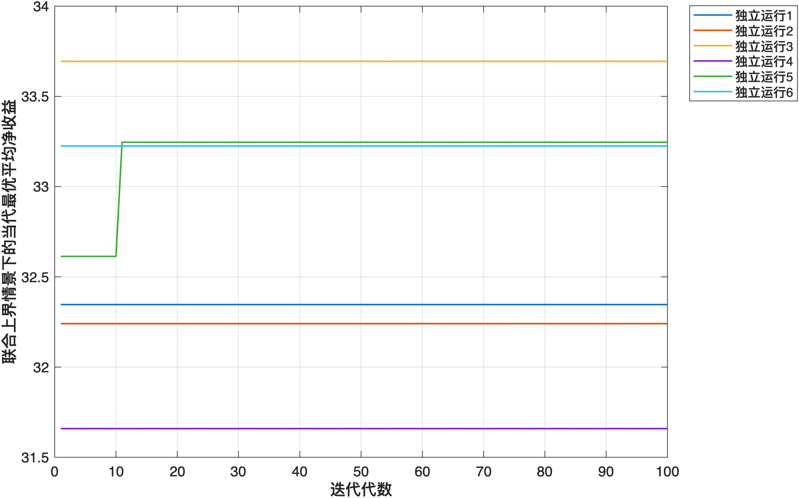

# 八、问题四的建模与解决

## 8.1 问题分析

### 8.1.1 题目要求与数学本质

问题四要求在零配件、半成品和成品次品率均由抽样检测获得的条件下，重新确定两类生产系统中的检测、拆解和回收策略。题给次品率不再是可直接代入的真实参数，而是有限样本形成的统计估计。抽样可能高估或低估实际质量风险，若仍把表中数值作为确定常数，所得策略只对单一参数点最优，无法回答抽样误差范围内应如何决策。

本问的输入包括题给样本次品率、各环节成本、售价、调换损失以及生产装配结构；需要输出各次品率的合理取值范围、该范围内的生产决策和对应收益。其数学本质是带有次品率取值范围的二进制决策问题：先由有限抽样推断真实次品率，再把参数区间传入随机生产闭环，最后从二进制策略空间中选择在次品率偏高时仍能保持较高收益的方案。

题目中的不确定性分为不同层次。真实次品率未知属于参数认知误差；给定次品率后，每件产品是否合格属于生产随机性；有限次仿真与真实期望之间的差异属于数值估计误差。三者不能由同一个概率量替代，因而需要分别建模：参数层给出置信范围，生产层模拟质量状态和成本累积，数值层用大样本复评控制误差。

### 8.1.2 模型选择依据

处理抽样次品率最直接的办法是将样本比例作为点估计代入收益模型。这种方法计算简单，但相同的样本比例可能由不同样本量得到，点估计不能反映其可信程度，也无法衡量参数偏差是否会改变最优策略。另一种选择是为次品率指定先验分布并建立贝叶斯随机规划，但题目没有提供历史先验或不同参数的联合分布，额外设定分布会引入无法由题目检验的参数。

区间方法只需要样本量和样本次品数，能够直接表达有限抽样造成的参数范围，更符合本题信息条件。由于样本量有限，且次品率包含5%这类低概率取值，正态近似在分布尾部可能产生偏差，因此采用基于二项分布的Clopper--Pearson精确置信区间。生产系统包含多个次品率，分别构造95%边际区间不足以保证所有参数同时被覆盖，故采用Bonferroni修正形成联合95%置信域。

获得参数区间后，可以比较区间中心、上下界和内部情景，也可以直接优化各情景的平均收益。题目没有给出不同次品率情景的发生概率，若对情景赋予人为权重，结果会依赖权重设定。因此，本文用区间内可能出现的最低期望收益评价每个策略：先找出一个策略在参数区间内的最低收益，再从全部策略中选择最低收益最高的方案。该准则不需要人为设定情景概率，并能直接回答“当真实次品率高于表中估计值时，应采用何种生产策略”。

生产收益由采购、检测、装配、市场调换、拆解和回收循环共同决定，难以写成简单显式函数。本文使用随机生产闭环和蒙特卡洛模拟计算给定策略的期望收益。问题二有效策略数量较少，采用完全枚举获得最优决策；问题三包含38个二进制位，策略空间达到 $2^{38}$，采用遗传算法搜索并以独立大样本统一复评。计算过程依次完成次品率区间估计、最低情景收益计算、生产闭环模拟和策略搜索。

### 8.1.3 建模路线

根据上述分析，本问先把题给次品率视为样本估计，按抽样方案确定样本量并反推整数次品数；随后构造Bonferroni修正的精确二项区间，并以各参数区间的笛卡尔积表示联合取值范围。对任一生产策略，在给定参数情景下模拟从采购到合格交付的完整闭环，以长期平均净收益作为评价量；再以联合置信范围中的最低期望收益为目标，分别通过完全枚举和遗传算法确定两类生产系统的决策。最后使用中心、边界和区间内部情景复评，检查最低收益是否出现在联合上界，并估计蒙特卡洛误差。总体路线为

$$
\text{样本次品率}
\longrightarrow
\text{样本量与次品数}
\longrightarrow
\text{联合置信区间}
\longrightarrow
\text{最低情景收益目标}
\longrightarrow
\text{生产策略优化与复评}.
$$

### 8.1.4 质量参数口径与模型边界

零配件次品率表示采购零配件本身不合格的概率。半成品和成品次品率均解释为合格投入条件下，当前装配工序自身产生次品的概率。设半成品 $j$ 的零配件集合为 $\mathcal G_j$，其质量状态为

$$
G_j^{(s)}=
\left(\prod_{i\in\mathcal G_j}G_i^{(c)}\right)A_j^{(s)},
\qquad
P\left(A_j^{(s)}=0\right)=p_j^{(s)}.
$$

三个半成品装配为成品后，有

$$
G^{(f)}=
\left(\prod_{j=1}^{3}G_j^{(s)}\right)A^{(f)},
\qquad
P\left(A^{(f)}=0\right)=p_f.
$$

该定义将上游投入缺陷与当前工序失效分开，使每类抽样数据均对应唯一的模型参数。生产闭环假设不同质量事件相互独立，检测结果完全准确，拆解不改变组成对象质量，一份订单的销售收入只计一次，调换损失和替换品的重新生产成本均计入周期成本。

## 8.2 抽样数据重构与联合置信区间

### 8.2.1 样本量与次品数

题目未给出各类对象的实际样本量和样本次品数。按照问题一的抽样方案，本文将表中次品率 $\hat p_j$ 视为样本估计，并分别计算接收与拒收方案的推荐样本量。为了形成一组用于参数估计的抽样记录，取二者中的较大者：

$$
n_j=\max\left\{n_j^{(a)},n_j^{(r)}\right\}.
$$

由于样本次品数必须为整数，按下式反推：

$$
x_j=\operatorname{round}(n_j\hat p_j).
$$

三种题给次品率对应的样本量和次品数见表8-1。10%次品率对应 $n=105,x=11$，故实际用于区间计算的样本比例为 $11/105\approx10.476\%$；中心情景仍按题给10%取值，该差异来自整数化处理。

**表8-1 题给次品率对应的抽样记录**

| 题给次品率 | 拒收推荐样本量 | 接收推荐样本量 | 最终样本量 $n$ | 次品数 $x$ |
|---:|---:|---:|---:|---:|
| 5% | 94 | 106 | 106 | 5 |
| 10% | 85 | 105 | 105 | 11 |
| 20% | 77 | 79 | 79 | 16 |

表8-1中的样本量由问题一的临界比例标准差稳定性规则确定，因此其大小不能解释为一般意义上的估计精度排序。

### 8.2.2 精确二项置信区间

设第 $j$ 类对象抽取 $n_j$ 件，其中有 $X_j$ 件次品，则

$$
X_j\sim\operatorname{Bin}(n_j,p_j),
$$

其中 $p_j$ 为未知总体次品率。观察到 $X_j=x_j$ 后，采用 Clopper--Pearson 精确二项区间。给定单参数显著性水平 $\alpha_j$，区间下限和上限分别为

$$
p_j^L=B^{-1}\left(\frac{\alpha_j}{2};x_j,n_j-x_j+1\right),
$$

$$
p_j^U=B^{-1}\left(1-\frac{\alpha_j}{2};x_j+1,n_j-x_j\right),
$$

其中 $B^{-1}(q;a,b)$ 表示参数为 $(a,b)$ 的Beta分布在概率 $q$ 处的分位数。该区间直接依据二项分布计算，不使用正态近似，适用于本题有限样本和低次品率情形。

### 8.2.3 Bonferroni联合修正

问题二和问题三需要同时估计多个次品率。若各参数分别使用95%区间，所有真实参数同时落入对应区间的概率不能保证达到95%。设同一优化问题包含 $d$ 个次品率参数，总体显著性水平为 $\alpha=0.05$，本文令

$$
\alpha_j=\frac{0.05}{d},\qquad j=1,2,\ldots,d.
$$

由Bonferroni不等式可得

$$
P\left(p_1\in I_1,\ldots,p_d\in I_d\right)
\geq 1-\sum_{j=1}^{d}\alpha_j=0.95.
$$

问题二的每种情形含两个零配件次品率和一个成品工序次品率，故 $d=3$；六种情形是六个独立的生产环境，分别进行三参数联合修正。问题三包含8个零配件次品率、3个半成品工序次品率和1个成品工序次品率，故 $d=12$。相应区间见表8-2。

**表8-2 Bonferroni修正后的次品率区间**

| 使用位置 | 参数个数 $d$ | 题给次品率 | 精确置信区间 |
|:---|---:|---:|:---:|
| 问题二 | 3 | 5% | [0.011683, 0.121363] |
| 问题二 | 3 | 10% | [0.045429, 0.197320] |
| 问题二 | 3 | 20% | [0.106305, 0.331524] |
| 问题三 | 12 | 10% | [0.037684, 0.217293] |

问题三对12个参数同时提供覆盖保证，单参数显著性水平降为 $0.05/12$，故其10%次品率区间比问题二的三参数区间更宽。

### 8.2.4 抽样成本口径

问题一和问题四中的抽样检测用于识别一批产品的质量参数，问题二、三中的生产检测则用于判断某个具体零配件、半成品或成品能否进入下一工序。两类检测的作用对象不同。若批次规模为 $M$、抽样总成本为 $C_{\mathrm{sample}}$，其单位分摊成本应为 $C_{\mathrm{sample}}/M$。题目未给出批次规模及单独的抽样费用，无法将该项成本换算到一次合格交付，因此本文不把抽样成本重复计入问题二、三的周期收益；表中检测成本仍按原生产决策模型逐件核算。

## 8.3 联合置信上界下的决策模型

### 8.3.1 次品率的联合取值范围

设同一生产问题的次品率向量为

$$
\boldsymbol p=(p_1,p_2,\ldots,p_d),
$$

由各参数精确置信区间构造联合取值范围

$$
\Theta=\prod_{j=1}^{d}[p_j^L,p_j^U]
=\left\{\boldsymbol p:p_j^L\leq p_j\leq p_j^U,\ j=1,\ldots,d\right\}.
$$

对生产策略 $S$，沿用前文的周期净收益

$$
R(S)=V-C_{\mathrm{purchase}}-C_{\mathrm{inspection}}
-C_{\mathrm{assembly}}-C_{\mathrm{return}}-C_{\mathrm{disassembly}}.
$$

在给定次品率向量 $\boldsymbol p$ 时，其期望收益为

$$
F(S;\boldsymbol p)=E[R(S)\mid S,\boldsymbol p].
$$

记按表中次品率选择的策略为 $S_{\hat p}^*$，按联合置信范围内最低收益选择的策略为 $S_U^*$，分别定义为

$$
S_{\hat p}^*
=\arg\max_{S\in\Omega}F(S;\hat{\boldsymbol p}),
$$

$$
S_U^*
=\arg\max_{S\in\Omega}
\min_{\boldsymbol p\in\Theta}F(S;\boldsymbol p).
$$

第一个策略只考虑题目表中给出的次品率。第二个策略的含义是：对每个候选策略，先计算其在联合置信范围内可能得到的最低收益，再比较所有候选策略的这一最低收益，并选择数值最大者。下文将二者分别简称为“表中次品率策略”和“上界情景策略”。这里的“上界情景策略”不是另一套生产模型，而是把真实次品率同时取到各自置信区间的上界后，仍用同一个生产闭环收益模型选择策略。

### 8.3.2 最低收益情景的确定

在既定生产策略下，提高某个次品率会使部分原本合格的质量状态转为不合格，并增加重复采购、检测淘汰、重复装配、市场调换或拆解循环。销售收入对一份订单只计一次，缺陷本身不产生额外收益，回收只能抵消部分新增成本。因此，在本文假设下，固定策略的期望收益关于各次品率均为非增函数，即

$$
p_j^{(1)}\leq p_j^{(2)}
\quad\Longrightarrow\quad
F(S;p_j^{(1)})\geq F(S;p_j^{(2)}).
$$

于是，联合置信范围内的最低收益出现在全部参数同时取上界时：

$$
\boldsymbol p^U=(p_1^U,p_2^U,\ldots,p_d^U),
$$

$$
\min_{\boldsymbol p\in\Theta}F(S;\boldsymbol p)
=F(S;\boldsymbol p^U).
$$

因此，前述“先求区间内最低收益、再比较策略”的计算可化为

$$
S_U^*
=\arg\max_{S\in\Omega}F(S;\boldsymbol p^U).
$$

这一步只是利用收益随次品率上升而不增加的性质，将区间内搜索简化为联合上界处的一次评价，并未改变原来的选择准则。中心、联合下界、单参数上下界和区间内部拉丁超立方情景仅用于检验该单调性及比较策略表现，不参与策略目标的重新定义。

### 8.3.3 两类策略的收益差额

为衡量改用上界情景策略后在表中次品率情景下的收益变化，定义中心情景收益差

$$
\Delta F_{\mathrm{center}}=
F(S_{\hat p}^*;\hat{\boldsymbol p})
-F(S_U^*;\hat{\boldsymbol p}).
$$

该量表示从表中次品率策略转为上界情景策略后，在表中次品率下减少的平均收益。进一步定义联合上界收益增量

$$
\Delta F_{\mathrm{upper}}=
F(S_U^*;\boldsymbol p^U)
-F(S_{\hat p}^*;\boldsymbol p^U),
$$

用于衡量改用上界情景策略后，在所有次品率同时取置信上界时增加的平均收益。

## 8.4 问题二在次品率区间下的决策优化

### 8.4.1 求解方法

问题二的生产策略采用8位编码

$$
x_1x_2\mid yz\mid r_1r_2\mid u_1u_2.
$$

经无效决策修复后共有80种有效策略。对表1的六种情形，本文分别计算三参数联合区间，将对应上界代入原随机生产闭环，并对80种策略各进行100000次蒙特卡洛仿真，以联合上界情景下的平均净收益确定上界情景策略。随后在中心、联合上下界、6个单参数边界及64个拉丁超立方内部情景中进行复评，每个验证情景使用30000次仿真。

### 8.4.2 两类策略的计算结果

六种情形在表中次品率和联合上界下选出的策略见表8-3。表中同时列出上界情景策略在联合上界下的收益、中心情景收益差和联合上界收益增量。

**表8-3 问题二表中次品率策略与上界情景策略比较**

| 情形 | 表中次品率策略 | 上界情景策略 | 上界策略收益/元 | 中心情景收益差/元 | 联合上界收益增量/元 |
|---:|:---:|:---:|---:|---:|---:|
| 1 | `10\|01\|01\|11` | `11\|01\|00\|11` | 12.1314 | 0.7247 | 1.8740 |
| 2 | `11\|01\|00\|11` | `11\|01\|00\|11` | 1.2041 | 0 | 0 |
| 3 | `10\|11\|01\|11` | `11\|11\|00\|11` | 9.8932 | 1.0648 | 1.1272 |
| 4 | `11\|11\|00\|11` | `11\|11\|00\|11` | 5.6496 | 0 | 0 |
| 5 | `01\|01\|00\|01` | `01\|11\|00\|01` | 6.1800 | 0.0316 | 2.4341 |
| 6 | `00\|00\|00\|00` | `10\|00\|00\|00` | 13.1547 | 0.3474 | 3.2313 |

### 8.4.3 决策变化分析

情形1和情形3的上界情景策略均增加了新购零配件2检测。10%样本估计对应的联合上界为19.732%，不检测零配件2时，坏件进入装配并引发重复生产的概率上升。将检测前移至采购端后，零配件2以确定合格状态进入装配；在检测准确、拆解无损的条件下，回收后也无需重复检测。因此编码由回收检测位 $01$ 转为新件检测位 $11$、回收检测位 $00$。

情形2和情形4的策略未发生变化。两种原策略均已检测两个新购零配件；情形4还检测成品，原决策已覆盖联合上界下主要的质量风险。情形2的成品调换损失较低，持续支付成品检测费不能提高联合上界下的期望收益，故仍不检测成品。

情形5只增加成品检测。上界情景策略仍检测零配件2而不检测零配件1，但零配件1和成品工序的次品率均可能达到19.732%。在零配件2已知合格时，零配件1缺陷与成品工序失效叠加后的成品次品概率约为

$$
1-(1-0.197320)^2\approx0.3556,
$$

高于表中次品率下的 $1-(1-0.1)^2=0.19$。此时支付2元进行成品检测比承担10元市场调换损失更有利。该调整使表中次品率下的平均收益减少0.0316元，同时使联合上界下的平均收益增加2.4341元。

情形6的题给次品率为5%，表中次品率策略不进行任何检测、拆解和回收。联合上界提高至12.136%后，完全不检测的重复生产风险增大，上界情景策略增加检测成本较低的零配件1，但零配件2检测、成品检测和高成本拆解仍不经济。该调整使表中次品率下的平均收益减少0.3474元，但使联合上界下的平均收益增加3.2313元，是六种情形中收益变化最明显的一种。

## 8.5 问题三在次品率区间下的决策优化

### 8.5.1 参数情景与遗传算法

问题三的12个次品率样本估计均为10%，经联合修正后有

$$
p_j\in[0.037684,0.217293],\qquad j=1,2,\ldots,12.
$$

问题三的生产策略采用38位二进制编码，并根据拆解、利用及已知质量状态清除无效决策位。在全部次品率取上界0.217293的情景下运行遗传算法。搜索采用种群80、100代、交叉概率0.8、变异概率0.03、锦标赛规模3和精英数2；每次适应度使用1200个生产周期，共独立运行6次，每次保留10个候选。合并去重后，对候选策略进行300000次独立仿真复评。

### 8.5.2 策略与收益比较

按表中次品率选择的策略为

$$
11111111\mid111\mid0\mid111\mid1
\mid00000000\mid11111111\mid000\mid111,
$$

按联合上界选择的策略为

$$
11111111\mid111\mid1\mid111\mid1
\mid00000000\mid11111111\mid000\mid111.
$$

两者仅在成品检测位上不同。上界情景策略检测全部新购零配件、三个半成品及成品；三类不合格半成品和不合格成品均拆解；回收零配件与回收半成品不重复检测，全部重新利用。核心收益见表8-4。

**表8-4 问题三表中次品率策略与上界情景策略的收益比较**

| 策略 | 中心情景收益/元 | 联合上界收益/元 | 联合上界95%蒙特卡洛区间/元 |
|:---|---:|---:|:---:|
| 表中次品率策略 | 60.1753 | 29.1258 | — |
| 上界情景策略 | 58.0771 | 32.6135 | [32.5093, 32.7177] |

上界情景策略相对于表中次品率策略的中心情景收益差为

$$
\Delta F_{\mathrm{center}}=60.1753-58.0771=2.0982\text{元},
$$

联合上界收益增量为

$$
\Delta F_{\mathrm{upper}}=32.6135-29.1258=3.4877\text{元}.
$$

因此，增加成品检测使表中次品率下的平均收益下降2.0982元，但使所有次品率同时取置信上界时的平均收益提高3.4877元。

### 8.5.3 成品检测决策的转换机理

表中次品率策略已经检测全部新购零配件和半成品，故进入最终装配的半成品均为合格状态，剩余质量风险集中在成品装配工序。设其失效率为 $p_f$。若检测成品，每完成一件合格交付所需的理论检测费用为

$$
C_{\mathrm{inspect}}=\frac{6}{1-p_f}.
$$

若不检测成品，每次不合格均进入市场，完成一件合格交付前的理论调换损失为

$$
C_{\mathrm{return}}=40\frac{p_f}{1-p_f}.
$$

两者的临界条件为

$$
\frac{6}{1-p_f}<40\frac{p_f}{1-p_f}
\quad\Longleftrightarrow\quad
p_f>0.15.
$$

表中数值 $p_f=0.10$ 低于临界值，因此对应策略不检测成品；联合上界 $p_f^U=0.217293$ 高于临界值，上界情景策略转为检测成品。以两种参数代入，可得

$$
p_f=0.10:\quad
C_{\mathrm{inspect}}=6.6667,
\quad C_{\mathrm{return}}=4.4444,
$$

$$
p_f=0.217293:\quad
C_{\mathrm{inspect}}\approx7.666,
\quad C_{\mathrm{return}}\approx11.105.
$$

该理论比较与遗传算法给出的检测位变化一致。回收对象仍不重复检测，是因为新购零配件和半成品已通过检测，且无损拆解不改变质量；再次检测只增加成本，不增加质量信息。

## 8.6 结果检验

### 8.6.1 情景边界检验

问题二对每种情形构造中心、联合上下界、6个单参数边界和64个拉丁超立方内部情景；问题三构造中心、联合上下界、24个单参数边界和128个拉丁超立方内部情景。对表中次品率策略和上界情景策略分别进行独立复评后，所有问题二情形以及问题三的最低平均收益均出现在联合上界情景，与收益关于次品率非增的机理判断一致。

### 8.6.2 蒙特卡洛精度与重复搜索结果

问题二对全部80种有效策略进行100000次仿真，故最终结果来自全枚举而非启发式近似。问题三无法枚举 $2^{38}$ 个原始编码，采用6次独立遗传搜索。图8-2给出了联合上界情景下的收敛过程。

6次搜索中有5次得到最终采用的上界情景编码，第5次得到的另一候选策略仅将回收零配件1由利用改为废弃。300000次统一复评下，最终策略的联合上界收益为32.6135元，另一候选策略为31.4421元，表中次品率策略约为29.04元。最终策略的95%蒙特卡洛区间宽度约为0.2084元，且全部正式验证样本的闭环完成率均为1，说明循环上限没有影响入选策略的收益评价。

由于问题三使用启发式搜索，最终方案应表述为“在6次独立搜索中重复出现，并在大样本统一复评中收益最高的候选策略”，不作严格全局最优声明。

## 8.7 本问小结

本文先把题给次品率视为样本估计，根据既定选样规则反推样本次品数，再使用Bonferroni修正的Clopper--Pearson精确区间构造联合95%次品率取值范围。由于固定策略的收益随次品率上升而不增加，区间内的最低收益出现在所有次品率同时取上界时，因而在联合上界情景下选择检测、拆解和回收策略。

问题二的六种情形中，情形2和4的两类策略相同，情形1和3的上界情景策略增加新购零配件2检测，情形5增加成品检测，情形6增加新购零配件1检测。问题三的上界情景策略在表中次品率策略的基础上增加成品检测，表中次品率下的收益由60.1753元降至58.0771元，但联合上界收益由29.1258元提高至32.6135元。结果表明，抽样误差不会使所有环节一律转为检测，而会使决策在容易放大质量损失的环节增加检测。
