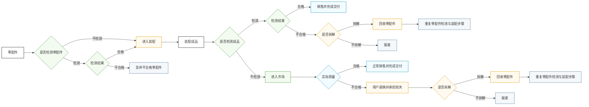
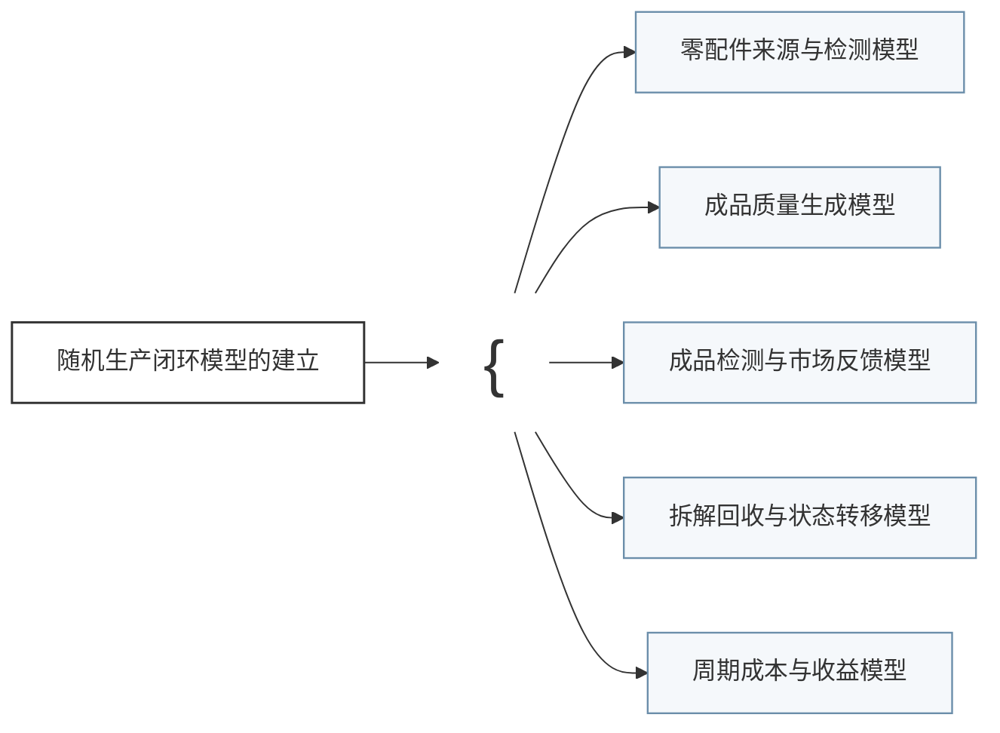
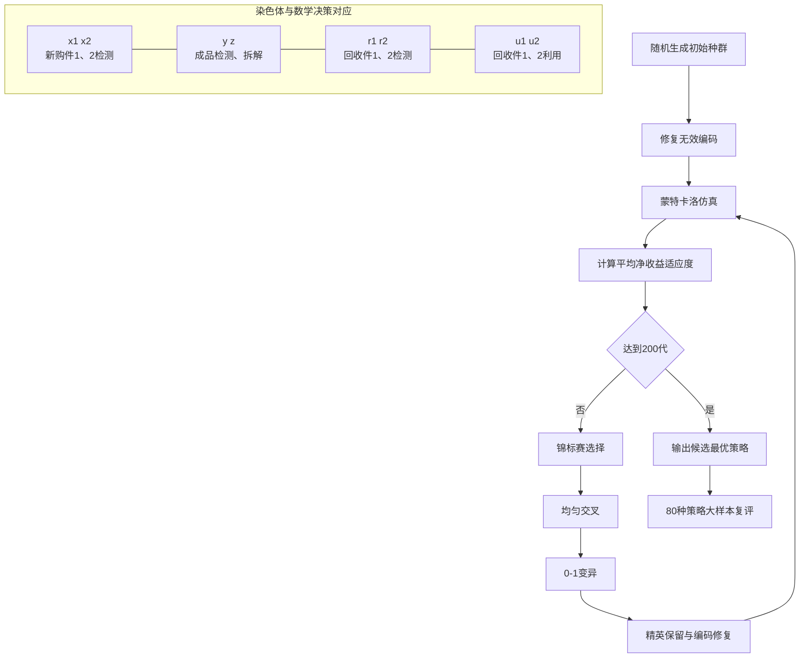

# 问题一与问题二图示代码

本文档集中保存当前初稿中需要重新绘制或组合的全部图件。问题一图5-1和问题二图6-4采用 MATLAB 绘制；问题二图6-1至图6-3采用 Mermaid 描述，可在 Mermaid 编辑器中导出 SVG 后插入 Word、Visio 或 LaTeX，也可在 Visio 中按相同节点和连线重新绘制。

# 一、问题一图件

## 图5-1 两种判定模型的检测数量与临界比例标准差曲线

- 建议文件名：`q1_fig5-1_sigma_comparison.png`
- 子图（a）：拒收模型的检测数量与临界比例标准差曲线。
- 子图（b）：接收模型的检测数量与临界比例标准差曲线。
- 原始曲线由 `第一问/problem1_binomial_experiment.m` 生成，下列代码将两张原始曲线合并为一张并列的（a）（b）图。

### 论文中的位置与作用

- **出现位置：**置于“5.7 求解结果”第一段之后。正文先用一句话说明 MATLAB 枚举得到了两类判定模型的临界比例标准差曲线，随后立即放置本图，再分析稳定区间和最终检测数量。
- **主要作用：**同时展示拒收模型和接收模型的标准差随检测数量增加而下降的规律，为采用标准差收敛判据选取样本量提供直接证据。子图（a）支撑拒收方案取 $n_r=85$，子图（b）支撑接收方案取 $n_a=105$。
- **阅读重点：**图中应保留推荐检测数量的竖直标记和对应点，使读者能够看出曲线由快速下降转入平缓区间；接收模型的锯齿变化还用于说明临界次品数只能取整数所造成的离散波动。
- **前后衔接：**图前负责提出“曲线结果”，图后负责给出 $n=85\sim94$ 和 $n=105\sim114$ 两个稳定区间，并用一句话汇总两套抽样判定方案。

```matlab
rejectFile = '第一问/results_problem1/reject_sigma_curve.png';
acceptFile = '第一问/results_problem1/accept_sigma_curve.png';

rejectImage = imread(rejectFile);
acceptImage = imread(acceptFile);

fig = figure('Color','w','Position',[100 100 1500 620]);
tiledlayout(1,2,'TileSpacing','compact','Padding','compact');

nexttile;
imshow(rejectImage);
axis image off;
title('（a）拒收模型','FontSize',11,'FontWeight','normal');

nexttile;
imshow(acceptImage);
axis image off;
title('（b）接收模型','FontSize',11,'FontWeight','normal');

exportgraphics(fig, ...
    '第一问/results_problem1/q1_fig5-1_sigma_comparison.png', ...
    'Resolution',300);
```

# 二、问题二图件

## 图6-1 问题二生产全过程决策流程

- 建议文件名：`q2_fig6-1_problem_process_flow.svg`
- 推荐版式：参照题目第（1）—（4）点的叙述顺序绘制横向分支流程。左侧从零配件检测开始，中部进入装配与成品检测，右侧展开市场调换、拆解、回收和报废等结果，整体形式与所给示例的树状决策流程一致。

### 论文中的位置与作用

- **出现位置：**置于“6.1.1 决策耦合与核心假设”中，紧接题目决策关系的概括段之后、两项核心假设的文字说明之前。
- **主要作用：**将题目第（1）—（4）点关于零配件检测、成品检测、市场销售、用户调换、不合格品拆解和零配件回收的文字描述转换为一张分支流程图，使读者在进入数学模型前先完整掌握企业的实际决策步骤。
- **阅读重点：**零配件检测与不检测路径最终汇入装配环节；成品检测与不检测路径必须分开。检测后，不合格品在企业内部被发现；不检测时，不合格品进入市场后产生调换损失。两条不合格路径均进一步区分拆解与不拆解，拆解后回收零配件并重复前述步骤，不拆解则报废。
- **前后衔接：**图前用文字概括各项决策相互关联，图中把原问题的叙述步骤图片化，图后再说明成品次品率口径和完整生产周期收益口径两项核心假设。



## 图6-2 随机生产闭环模型的数学抽象组成

- 建议文件名：`q2_fig6-2_model_components.svg`
- 推荐版式：左侧只放“随机生产闭环模型的建立”，右侧用大括号列出6.2.1—6.2.5对应的五个组成部分。五个子模型之间不画箭头，不表达先后、因果或反馈关系。

### 论文中的位置与作用

- **出现位置：**置于“6.2 随机生产闭环模型的建立”开头，在 $x_i,r_i,u_i,y,z$ 等决策变量的总体说明之后、“6.2.1 零配件来源与检测”之前。
- **主要作用：**说明本节对随机生产闭环所作的数学抽象由哪几个部分构成，使读者在阅读具体公式之前先掌握模型的章节边界和组成层次。
- **阅读重点：**右侧五项必须与6.2.1—6.2.5的三级标题逐项一致；本图只表示“包含关系”，不表示五个子模型之间的运行顺序或状态转移关系。
- **前后衔接：**图前给出决策变量并说明模型被划分为五部分，图后依次进入各子模型的定义与公式。



> Visio重绘时，建议删除连接五个子模型的箭头，仅使用一个左大括号把五项括在一起；Mermaid代码中的括号节点只是为了近似表现该版式。

## 图6-3 遗传算法求解流程与染色体映射

- 建议文件名：`q2_fig6-3_ga_flow.svg`
- 推荐版式：上部为经典遗传算法循环，下部为8位染色体与四类决策的对应关系。

### 论文中的位置与作用

- **出现位置：**置于“6.3.2 遗传算法搜索”中，在8位染色体及其基因含义的文字说明之后、遗传算法参数设置之前。
- **主要作用：**用经典遗传算法流程替代冗长的逐条算法步骤，清楚表达初始化、编码修复、蒙特卡洛适应度评价、选择、交叉、变异、精英保留和终止判断的循环关系；下半部分同时给出基因序列与数学决策量的对应。
- **阅读重点：**染色体必须按 $x_1x_2\mid yz\mid r_1r_2\mid u_1u_2$ 分成四组，使读者能够从基因位直接还原“新购件检测—成品检测与拆解—回收件检测—回收件利用”四类决策。交叉或变异后应再次经过无效编码修复。
- **前后衔接：**图前解释染色体组成与适应度含义，图后只需列出种群规模、迭代次数、交叉概率、变异概率等参数，不再重复完整算法步骤。



## 图6-4 六种生产情形最优决策的0-1热力矩阵

- 建议文件名：`q2_fig6-4_decision_heatmap.png`
- 子图（a）：$x_1,x_2,y,z$，对应新购件1检测、新购件2检测、成品检测和不合格品拆解。
- 子图（b）：$r_1,r_2,u_1,u_2$，对应回收件1检测、回收件2检测、回收件1利用和回收件2利用。
- 色块和数字均表示二进制决策：1为执行，0为不执行。

### 论文中的位置与作用

- **出现位置：**置于“6.4.1 最优策略”中，紧接只保留“情形、最优染色体、平均净收益”的结果表以及基因含义说明之后，放在典型情形的合理性分析之前。
- **主要作用：**将六种情形的8位最优染色体展开为统一的0-1矩阵，使不同情形在新购件检测、成品检测、拆解、回收检测和回收利用上的差异能够直接横向比较。结果表负责给出精确策略和收益，本图负责揭示决策模式。
- **阅读重点：**每个单元格必须同时显示颜色和数字0或1，避免只靠颜色表达含义；横轴应写出每个基因及其业务含义。为防止标签过密，按前端与成品决策、回收决策拆成（a）（b）两个子图，并保持六种情形的纵轴顺序一致。
- **前后衔接：**图前说明8个基因的定义，图后选取情形1与3、情形2与4、情形5与6解释成本参数为何推动相应基因取0或1，从直观经济逻辑上说明所得策略具有合理性。

```matlab
% 六种情形最优染色体，列顺序为 x1 x2 y z r1 r2 u1 u2
decision = [
    1 0 0 1 0 1 1 1;
    1 1 0 1 0 0 1 1;
    1 0 1 1 0 1 1 1;
    1 1 1 1 0 0 1 1;
    0 1 0 1 0 0 0 1;
    0 0 0 0 0 0 0 0
];

frontLabels = {'x_1 新购件1检测','x_2 新购件2检测', ...
               'y 成品检测','z 不合格品拆解'};
recycleLabels = {'r_1 回收件1检测','r_2 回收件2检测', ...
                 'u_1 回收件1利用','u_2 回收件2利用'};
scenarioLabels = compose('情形%d',1:6);

figure('Color','w','Position',[100 100 1280 520]);
tiledlayout(1,2,'TileSpacing','compact','Padding','compact');
map = [0.90 0.90 0.90; 0.15 0.45 0.75];

ax1 = nexttile;
drawBinaryHeatmap(ax1,decision(:,1:4),frontLabels,scenarioLabels, ...
    '（a）新购件、成品与拆解决策',map);

ax2 = nexttile;
drawBinaryHeatmap(ax2,decision(:,5:8),recycleLabels,scenarioLabels, ...
    '（b）回收件检测与利用决策',map);

exportgraphics(gcf,'第二问/results/q2_fig6-4_decision_heatmap.png', ...
    'Resolution',300);

function drawBinaryHeatmap(ax,M,xLabels,yLabels,panelTitle,map)
    imagesc(ax,M,[0 1]);
    colormap(ax,map);
    axis(ax,'equal');
    axis(ax,'tight');
    ax.XTick = 1:size(M,2);
    ax.YTick = 1:size(M,1);
    ax.XTickLabel = xLabels;
    ax.YTickLabel = yLabels;
    ax.FontSize = 8;
    xtickangle(ax,25);
    title(ax,panelTitle,'FontSize',11,'FontWeight','normal');
    xlabel(ax,'决策基因');
    ylabel(ax,'生产情形');
    for i = 1:size(M,1)
        for j = 1:size(M,2)
            if M(i,j) == 1
                txtColor = 'w';
            else
                txtColor = 'k';
            end
            text(ax,j,i,num2str(M(i,j)), ...
                'HorizontalAlignment','center', ...
                'VerticalAlignment','middle', ...
                'FontSize',10,'FontWeight','bold', ...
                'Color',txtColor);
        end
    end
end
```
