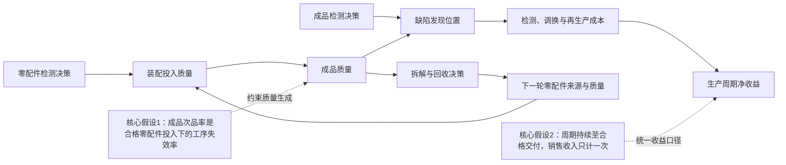
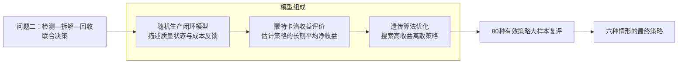
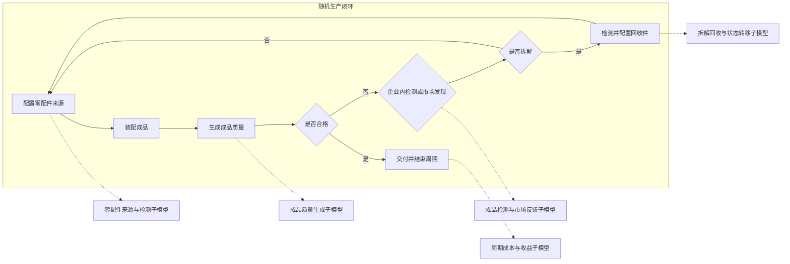
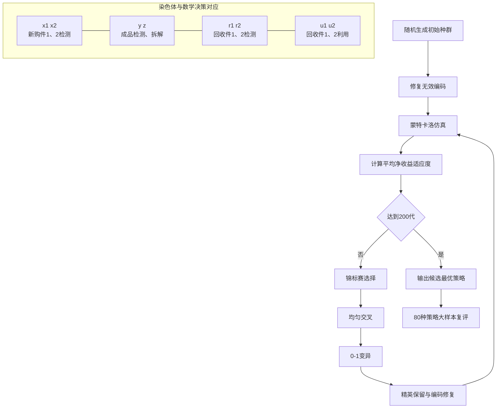

# 问题一与问题二图示代码

本文档集中保存当前初稿中需要重新绘制或组合的全部图件。问题一图5-1和问题二图6-5采用 MATLAB 绘制；问题二图6-1至图6-4采用 Mermaid 描述，可在 Mermaid 编辑器中导出 SVG 后插入 Word、Visio 或 LaTeX，也可在 Visio 中按相同节点和连线重新绘制。

# 一、问题一图件

## 图5-1 两种判定模型的检测数量与临界比例标准差曲线

- 建议文件名：`q1_fig5-1_sigma_comparison.png`
- 子图（a）：拒收模型的检测数量与临界比例标准差曲线。
- 子图（b）：接收模型的检测数量与临界比例标准差曲线。
- 原始曲线由 `第一问/problem1_binomial_experiment.m` 生成，下列代码将两张原始曲线合并为一张并列的（a）（b）图。

```matlab
rejectFile = '第一问/results_problem1/reject_sigma_curve.png';
acceptFile = '第一问/results_problem1/accept_sigma_curve.png';

rejectImage = imread(rejectFile);
acceptImage = imread(acceptFile);

fig = figure('Color','w','Position',[100 100 1500 620]);
tiledlayout(1,2,'TileSpacing','compact','Padding','compact');

nexttile;
imshow(rejectImage);
axis image off;
title('（a）拒收模型','FontSize',11,'FontWeight','normal');

nexttile;
imshow(acceptImage);
axis image off;
title('（b）接收模型','FontSize',11,'FontWeight','normal');

exportgraphics(fig, ...
    '第一问/results_problem1/q1_fig5-1_sigma_comparison.png', ...
    'Resolution',300);
```

# 二、问题二图件

## 图6-1 生产决策耦合关系与两项核心假设

- 建议文件名：`q2_fig6-1_decision_coupling.svg`
- 推荐版式：横向流程，两个核心假设置于主流程下方，以虚线连接其直接影响的环节。



## 图6-2 问题二的模型拆解与求解关系

- 建议文件名：`q2_fig6-2_method_map.svg`
- 推荐版式：左侧放“问题二联合决策优化”，右侧用一个大括号括住三个核心模块；Mermaid 中以分组框代替大括号，Visio 重绘时可改为右大括号。



## 图6-3 随机生产闭环及其子模型结构

- 建议文件名：`q2_fig6-3_closed_loop.svg`
- 推荐版式：左侧绘制闭环主流程，右侧列出五个子模型，并以虚线连接到对应环节。



## 图6-4 遗传算法求解流程与染色体映射

- 建议文件名：`q2_fig6-4_ga_flow.svg`
- 推荐版式：上部为经典遗传算法循环，下部为8位染色体与四类决策的对应关系。



## 图6-5 六种生产情形最优决策的0-1热力矩阵

- 建议文件名：`q2_fig6-5_decision_heatmap.png`
- 子图（a）：$x_1,x_2,y,z$，对应新购件1检测、新购件2检测、成品检测和不合格品拆解。
- 子图（b）：$r_1,r_2,u_1,u_2$，对应回收件1检测、回收件2检测、回收件1利用和回收件2利用。
- 色块和数字均表示二进制决策：1为执行，0为不执行。

```matlab
% 六种情形最优染色体，列顺序为 x1 x2 y z r1 r2 u1 u2
decision = [
    1 0 0 1 0 1 1 1;
    1 1 0 1 0 0 1 1;
    1 0 1 1 0 1 1 1;
    1 1 1 1 0 0 1 1;
    0 1 0 1 0 0 0 1;
    0 0 0 0 0 0 0 0
];

frontLabels = {'x_1 新购件1检测','x_2 新购件2检测', ...
               'y 成品检测','z 不合格品拆解'};
recycleLabels = {'r_1 回收件1检测','r_2 回收件2检测', ...
                 'u_1 回收件1利用','u_2 回收件2利用'};
scenarioLabels = compose('情形%d',1:6);

figure('Color','w','Position',[100 100 1280 520]);
tiledlayout(1,2,'TileSpacing','compact','Padding','compact');
map = [0.90 0.90 0.90; 0.15 0.45 0.75];

ax1 = nexttile;
drawBinaryHeatmap(ax1,decision(:,1:4),frontLabels,scenarioLabels, ...
    '（a）新购件、成品与拆解决策',map);

ax2 = nexttile;
drawBinaryHeatmap(ax2,decision(:,5:8),recycleLabels,scenarioLabels, ...
    '（b）回收件检测与利用决策',map);

exportgraphics(gcf,'第二问/results/q2_fig6-5_decision_heatmap.png', ...
    'Resolution',300);

function drawBinaryHeatmap(ax,M,xLabels,yLabels,panelTitle,map)
    imagesc(ax,M,[0 1]);
    colormap(ax,map);
    axis(ax,'equal');
    axis(ax,'tight');
    ax.XTick = 1:size(M,2);
    ax.YTick = 1:size(M,1);
    ax.XTickLabel = xLabels;
    ax.YTickLabel = yLabels;
    ax.FontSize = 8;
    xtickangle(ax,25);
    title(ax,panelTitle,'FontSize',11,'FontWeight','normal');
    xlabel(ax,'决策基因');
    ylabel(ax,'生产情形');
    for i = 1:size(M,1)
        for j = 1:size(M,2)
            if M(i,j) == 1
                txtColor = 'w';
            else
                txtColor = 'k';
            end
            text(ax,j,i,num2str(M(i,j)), ...
                'HorizontalAlignment','center', ...
                'VerticalAlignment','middle', ...
                'FontSize',10,'FontWeight','bold', ...
                'Color',txtColor);
        end
    end
end
```
